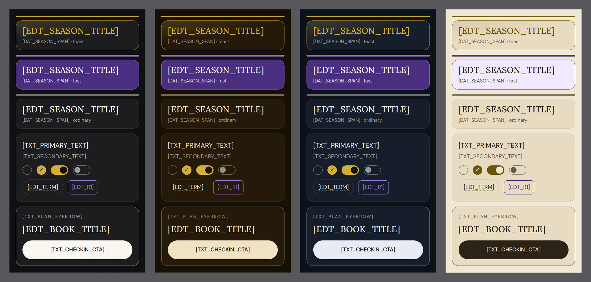

# Domestic Church Matrix and Catechumen Corner: structural specification

| | |
|---|---|
| Status | Draft v2. Phase 1 foundations are built on this branch; later phases are not. |
| Changes in v2 | Palette re-solved for all four app palettes and verified (72 of 72 pairs); layout fit re-measured with density rules; clergy review gates removed at the owner's direction (the owner accepts content in the admin queue); D-01 to D-05 decided; Phase 1 foundations built. |
| Date | 2026-09-25 |
| Scope | Structure, layout, interface rules and system constraints for two surfaces: the Domestic Church Matrix (family accounts) and the Catechumen Corner. |
| Not in scope | All copy and all liturgical, doctrinal or catechetical content. Every string is a typed placeholder (section 0.1). No route, table or migration exists yet. |
| Verification | Contrast ratios, font coverage, font payload, sheet budget and fold budget were measured, not estimated. Method in section 0.3 and Appendix A. Every claim about shipped code cites the file. |

## Summary for the owner

v2 applies three instructions: optimize the colors, optimize the fit, drop the clergy review gates. What changed, and what still needs you:

1. **Colors, decided and measured.** The feast banner is now a gold-lit card (glow, hairline, gold title) instead of a solid gold slab, which had about ten times the luminance of the card that replaces it and worked against the brief's own eye-strain goal. The fast banner keeps the brief's violet as a container. One violet accent, #9178D1, serves lines, icons and text. Every pair clears WCAG AA, most clear AAA, in all four app palettes: 72 of 72 (Appendix A), re-checked on every test run by `lib/ui/__tests__/litPalette.test.ts`.
2. **Light mode was a gap in v1, now closed.** The reading palettes apply to the whole app (`components/theme/AppThemeController.tsx`), and Light is free to every reader. v1 assumed these modules would always be dark. v2 solves the tokens for Default, Candlelight, Monastery and Parchment; Parchment needed its own gold ink (#6B5503) and a pale violet container (#F0E9FF).
3. **Fit, re-measured.** A tighter sheet header adds a line of body on every phone. A compact Card A on screens under 700px tall keeps the primary button above the fold at up to 150% text. The briefing preview clamps by lines rather than characters. The family matrix reflows by measurement, because iOS 15, the app's floor, has no container queries.
4. **Clergy review removed.** Content goes from draft to published when you accept it in the admin queue, the pattern patch notes already use. The feast and fast modes come from the calendar engine's own data, so no new rule is authored.
5. **Still yours to rule on:** children's profiles and religious-data consent (legal), whether Family is a Plus feature (pricing), and who answers Ask a Priest (section 0.2).

A known data issue, carried as a risk rather than a gate: `docs/editorial/fasting-rule-matrix.md` records nine defect rows in the fasting engine. The household card and the mode color show whatever the engine says, so accepting that proposal fixes both.

## 0. Conventions

### 0.1 Placeholder grammar

| Prefix | Meaning | Source of truth | Review path |
|---|---|---|---|
| `[TXT_*]` | Fixed interface copy: headings, labels, helper and error text | `lib/i18n/messages/*.json`, all 21 catalogs | Owner, house voice |
| `[EDT_*]` | Liturgical, doctrinal or catechetical content: season titles, saint names, fasting explanations, briefings, definitions, answers | Editorial tables with a publish state (section 3.7.1) | Owner acceptance in the admin queue |
| `[DAT_*]` | Runtime data: names, dates, states, positions | Database or calendar engine | None, computed |
| `[USR_*]` | User-written text: custom task titles, questions | User input, validated server-side | Moderation where another person reads it |
| `[ICN_*]` | Icon slot | `components/ui/icons/`, `components/calendar/fastMeta.tsx` | Owner |
| `[AUD_*]` | Audio asset hook | Per-entry URL, cached on first play | Editorial |
| `[CONST]` | Tunable system constant, shown with a recommended value | Code constant | Owner |

Aliases used only inside wireframes, where width is tight:

| Alias | Full slot |
|---|---|
| `[TSK_n]`, `[TSK_n_FULL]` | `[DAT_TASK_LABEL_n]`, short and full-length forms |
| `[ICN_FK]` | `[ICN_FAST_KIND]` |
| `[ICN_ND]` | `[ICN_NAMEDAY]` |
| `[EDT_Rn]` | `[EDT_RESTRICTION_n]` |
| `[EDT_Tn]` | `[EDT_TERM_n]` |
| `[TXT_MGD]` | `[TXT_MANAGED_TAG]` |
| `[DAT_ND]` | `[DAT_NAMEDAY_SHORT]` |
| `(AB)` | `[DAT_MONOGRAM]`, 32dp |

Wireframe glyphs: `▓` accent fill, `░` scrim, `[x]` completed, `[ ]` pending (in a form: an unchecked box), `[-]` not shared, `.` not assigned (renders nothing), `[--o]` toggle on, `[o--]` toggle off, heavy border `┏━┓` = the screen's one attention element, dashed box `╭┄╮` = secondary button, solid box = primary button. Right-margin numbers are heights in dp.

Rules:

1. Placeholders are design-time only. At runtime an empty slot renders nothing: no placeholder, no dash, no "coming soon". This is already house law ("empty sections render nothing rather than placeholders", `docs/editorial-standards.md`, line 3).
2. No `[EDT_*]` slot may carry AI-generated text in production. AI may draft into the admin queue; nothing reaches readers until the owner accepts it (the patch-notes pattern in `AGENTS.md`).
3. Every `[TXT_*]` key exists in all 21 catalogs before its surface ships. A lone English string in a translated screen is a known failure here (see the `nav.shop` note in `components/nav/MobileTabBar.tsx`).

### 0.2 Decision register

| ID | Decision | Resolution | Status |
|---|---|---|---|
| D-01 | Scope of the Dual Liturgical Palette | Scoped to the two modules through `.lit-surface`, on the shipped `--color-festal` plus module tokens. Restriction chips are monochrome, so the calendar's crimson and the modules' violet never sit side by side. App-wide adoption stays possible later. | Decided (v2) |
| D-02 | Base #121212 vs shipped #101013 | Keep the shipped `--color-night`. The two differ by 0.99 ΔE in OKLab, below the threshold of noticing, so there is no reason to fork or seam. | Decided (v2) |
| D-03 | Text #F9F6F0 vs shipped #FFFFFF | Alabaster inside `.lit-surface`, Default palette only (2.76 ΔE from white: visible, intended). Candlelight, Monastery and Parchment keep their own ink. | Decided (v2) |
| D-04 | Typefaces | Shipped faces per role (1.4); Cinzel not added (no Greek or Cyrillic). Reversible in one CSS rule. Inter vs DM Sans remains your open ASK for admin numerics. | Applied, reversible |
| D-05 | Mode mapping | From the engine's own data (1.3): a data-flagged feast is feast, an engine-classified fast day is fast, anything else is ordinary. Feast wins, as in `toneFor()`. | Decided (v2) |
| D-06 | Which task kinds appear in the shared feed | Scripture reading plan only in Phase 1. Prayer tasks never (`CONTRIBUTING.md`). Per-person fasting status not shown (privacy). Custom tasks wait for your ruling on prayer-like free text. | requires-owner, custom tasks only |
| D-07 | Managed (no-login) profiles for children under 13 | Required for families; minimal fields (2.8.8). | requires-legal |
| D-08 | Lawful basis for religious data | Explicit, versioned consent at creation and at each join; privacy policy update. | requires-legal |
| D-09 | Is Family a Purify Plus feature; store family sharing | Pricing and subscription terms are an owner stop condition. | requires-owner |
| D-10 | Ask a Priest operations: who answers, response window, safeguarding duties, attribution, Terms section 3 ("Not professional advice") | Name the priests who answer and a moderation rota before the flag turns on; legal pass on safeguarding and the Terms. | requires-owner, requires-legal |
| D-11 | Ask a Priest answer delivery | Private receipt on the device; a public archive only by per-question opt-in. | requires-owner |
| D-12 | Household limits | 1 household per user, 2 admins, 12 members, 3 daily tasks. | Applied as defaults |
| D-13 | Freshness transport | Visibility-aware polling (2.8.6). Realtime only if you ask for it. | Applied |
| D-14 | Placement | Household under the Community tab; the Corner as a Discover tile and route. | Applied as defaults |
| D-15 | 35% sheet vs the reader's inline gloss | Sheet rule in these two modules only; `GlossedText` stays inline. | Applied |
| D-16 | Relationship to v1.4 "Today's Catechism" | Siblings. The Corner may deep-link into catechism content but never shows its completion state or badges. One citation resolver. | Applied |

### 0.3 What was measured

| Claim | Method | Result |
|---|---|---|
| Contrast of every token pair, in all four app palettes | WCAG 2.x relative luminance; enforced by `lib/ui/__tests__/litPalette.test.ts`, which parses the tokens out of `app/globals.css` | 72 of 72 pass (Appendix A) |
| Script coverage of Cinzel, Playfair Display, Inter and the shipped faces | `fonts.googleapis.com/css2` subsets served, 2026-09-25 | Section 1.4 |
| Payload of the brief's faces | Sum of every woff2 subset served (the native export bundles all subsets, `app/layout.tsx`, lines 56 to 61) | Cinzel 40 KB, Playfair Display with italics 185 KB, Inter 219 KB |
| 35% sheet content window | Viewport arithmetic on nine sizes, both navigation modes, 100% and 130% text | Appendix B |
| Primary action above the fold | Native chrome heights from `MobileTopBar` (48) and `--tab-bar-h` (86), at 100%, 130% and 150% text | Appendix B |
| Platform floor | `IPHONEOS_DEPLOYMENT_TARGET` 15.0 in the Xcode project; `minSdkVersion` 24; phones portrait-locked on both stores | Section 1.5 |

### 0.4 Constants register

Recommended values. Each is a named code constant, never a literal at the call site.

| Constant | Recommended | Governs | Section |
|---|---|---|---|
| `[MAX_MEMBERS]` / `[MAX_ADMINS]` | 12 / 2 | Household size and co-admins | D-12 |
| `[MAX_DAILY_TASKS]` | 3 | Matrix columns; fits 360dp with 48dp cells | 2.5 |
| `[NAMEDAY_WINDOW_DAYS]` | 7 | How far ahead row A3 looks | 2.3 |
| `[NOTICE_WINDOW_DAYS]` | 3 | When the banner announces a mode change | 1.6 |
| `[SEGMENT_MAX]` | 30 | Discrete segments before the tracker goes continuous | 2.4 |
| `[POLL_MS]` / `[STALE_MS]` | 15000 / 45000 | Refresh cadence; when the feed says it is stale | 2.8.6 |
| `[GRACE_CUTOFF_LOCAL]` | 03:00 household time | Last moment yesterday can still be checked in | 2.8.4 |
| `[OUTBOX_MAX]` | 20 | Offline check-ins held on the device | 2.8.7 |
| `[INVITE_TTL_HOURS]` | 72 | Invite lifetime | 2.8.2 |
| `[RETENTION_DAYS_AFTER_PLAN]` | 30 | Check-in deletion after a plan ends | 2.8.8 |
| `[VACANCY_DAYS]` | 30 | Admin vacancy before the household is deleted | 2.8.8 |
| `[DEF_SHORT_MAX]` / `[DEF_LONG_MAX]` | 100 / 1200 characters | Sheet definition, sized to fit without scrolling on the worst supported phone (Appendix B) / full entry | 1.7, 3.5 |
| `[SHEET_FLOOR]` | 208px | Sheet height floor; engages only below a 594px viewport (split-screen), never on a supported portrait phone | 1.7 |
| `[COMPACT_BELOW]` | 700px viewport height | Switches Card A and the Corner masthead to their compact density | 1.6 |
| `[MATRIX_NAME_MIN]` | 72px x text scale | Narrowest name column before the feed reflows | 2.5 |
| `[MAX_CHIPS]` | 12 | Chips in the grid before "all terms" | 3.4 |
| `[BRIEFING_TITLE_MAX]` / `[MAX_BLOCKS]` | 60 characters / 4 | Briefing title and block count | 3.3 |
| `[BLOCK_MAX_CHARS]` / `[PREVIEW_LINES]` | 600 characters / 3 lines | Block body in full; lines shown on the card | 3.3 |
| `[BRIEFING_WINDOW_WEEKS]` | 8 | Briefings baked into the native bundle | 3.7.2 |
| `[ASK_MIN]` / `[ASK_MAX]` | 20 / 1200 characters | Question length | 3.6 |
| `[ASK_RATE]` / `[QUEUE_CAP]` | 3 per 24h per key / 200 untriaged | Abuse and backpressure | 3.7.4 |
| `[ANSWER_RETENTION_DAYS]` / `[UNANSWERED_EXPIRY_DAYS]` | 30 / 60 | Question and answer deletion | 3.7.4 |

---

## 1. System core

### 1.1 Reconciliation with the shipped design system

| Brief rule | What ships today | Consequence if built as briefed | Recommendation |
|---|---|---|---|
| Base #121212, "absolute pitch-black" | `--color-night` #101013, `themeColor` #101013 | #121212 is not pitch black, and that is correct: pure #000 smears on OLED and seams against the ramp (documented at `--color-night-deep`). The two differ by 0.99 ΔE. | Keep #101013 (D-02) |
| Text #F9F6F0 | `--color-paper` #FFFFFF at alphas | Warm text in two modules, white elsewhere: intended, like a vellum page. | Alabaster in the Default palette (D-03) |
| Byzantine Gold #D4AF37 | `--color-festal` #D4AF37, "real liturgical gold, for feast marks only" | None. Identical value. | Reuse `--color-festal`; do not redeclare. |
| Violet #4A2E80 for fasting | Fast days render crimson (`toneFor`); `FAST_DOT` colors each `FastKind`; a hue per named season | Same fact, two colors, depending on the screen. | Monochrome chips inside the modules; violet only for the mode (D-01) |
| Cinzel / Playfair Display | Lora (serif), DM Serif Display (display), DM Sans (sans), Noto per-script chains | Loss of face in 9 locales; about 444 KB more per install | Shipped faces (D-04) |
| Inter / System UI | DM Sans with Noto chain | Third sans in the product | DM Sans (D-04) |
| Bold only for biblical entities, tracking numbers, parent-assigned tasks | Global unlayered `h1, h2 ... h6 { font-weight: 700 }` (`app/globals.css`, lines 511 to 519) | Every heading is bold, which the brief forbids | Scoped override, section 1.4 |
| 35% bottom sheet for every popup | `components/ui/Sheet.tsx`: content-sized to `max-h-[85dvh]`; no focus move, no focus trap, no focus return; close button 40px | A second sheet primitive, or an inaccessible one | Extend the one primitive, section 1.7 |
| Dotted underline for terms | `GlossedText` already marks terms with a dotted underline and expands inline | One affordance, two behaviors across the app | D-15 |
| One dark palette | `AppThemeController` applies Default, Candlelight, Monastery or Parchment app-wide; Parchment (light) is free. The `globals.css` note that palettes stop at the reader's edge is stale. | A dark-only module breaks for every Light reader | Tokens solved per palette (1.2) |
| No secular gamification | `CONTRIBUTING.md`, "Reminders and streaks": no figures on prayer; a strict six-clause bar on everything else | None; the brief and the house rule agree. The rule set in 1.8 is derived from it. | Adopt 1.8 |

### 1.2 Color system

Built: `app/globals.css`, section "Liturgical surfaces", beside the reading-mode palettes it is solved against. Plain custom properties, like the calendar's `--tone`, not `@theme` entries: Tailwind drops theme variables no utility uses.

Tonal pairs. Each mode has a **container** (the season as area) and an **accent** (the season as line, icon and heading). Tokens are scoped to `.lit-surface`, written as literal colors (no `color-mix()`, which iOS 15 lacks), and solved separately for each app palette, because `AppThemeController` applies the reader's palette to every screen and Parchment, the light one, is free.

| Token (`.lit-surface`) | Default | Candlelight | Monastery | Parchment | Role |
|---|---|---|---|---|---|
| `--color-paper` (remapped) | #F9F6F0 Alabaster | palette's own | palette's own | palette's own | Primary text; primary button fill |
| `--lit-muted` | paper at 0.60 | paper at 0.60 | paper at 0.60 | paper at 0.70 | Secondary text. Never `text-paper/60` here: it fails on Parchment (3.75:1). |
| `--lit-line` | paper at 0.40 | paper at 0.40 | paper at 0.40 | paper at 0.55 | Non-text neutral: pending ring, rules, dotted underline, attention border |
| `--lit-feast` | #D4AF37 | #D4AF37 | #D4AF37 | #6B5503 | Feast accent; completed disc; toggle on; celebratory heading |
| `--lit-feast-glow` | gold at 0.20 | gold at 0.20 | gold at 0.20 | ink at 0.10 | Feast banner glow |
| `--lit-feast-border` | gold at 0.60 | gold at 0.60 | gold at 0.60 | ink at 0.75 | Feast banner hairline |
| `--lit-fast` | #4A2E80 | #4A2E80 | #4A2E80 | #F0E9FF | Fast container |
| `--lit-on-fast` | #F9F6F0 | #F9F6F0 | #F9F6F0 | Parchment ink | Text on the fast container |
| `--lit-fast-accent` | #9178D1 | #9178D1 | #9178D1 | #4A2E80 | Fast accent: rule, outlines, icons, text |
| `--lit-fast-border` | accent at 0.75 | accent at 0.75 | accent at 0.75 | accent at 0.75 | Fast banner hairline |

Rendered from the shipped tokens, left to right Default, Candlelight, Monastery, Parchment: the feast, fast and ordinary banners with their mode rules, then the pending ring, completed disc, toggles, a vocabulary chip, a fast-accent chip, and an attention card holding the primary button.



How the values were found, so they can be re-derived: the violet accent keeps the brief's hue (OKLCH 295) and takes the first lightness that clears 4.6:1 on every dark page and card; Parchment's gold ink keeps the festal hue, drops lightness, and trims chroma to stay in gamut until it clears 4.6:1 on page, card and glow; the neutral alphas are the smallest that clear 3:1 (lines) and 4.5:1 (text) on page and card in every palette of the same polarity.

Mode resolution. The module root carries `data-mode` from `resolveMode()` (1.3), and exactly one variable changes:

```css
.lit-surface                    { --mode-accent: var(--lit-line); }        /* ordinary */
.lit-surface[data-mode="feast"] { --mode-accent: var(--lit-feast); }
.lit-surface[data-mode="fast"]  { --mode-accent: var(--lit-fast-accent); }
```

Banner recipes (Card A, and any mode container):

| Mode | Surface | Hairline | Title | Span |
|---|---|---|---|---|
| Feast | `--color-night-soft` under a radial glow of `--lit-feast-glow` from the top-left corner | `--lit-feast-border` | `--lit-feast` (celebratory heading) | `--lit-muted` |
| Fast | `--lit-fast` | `--lit-fast-border` | `--lit-on-fast` | `--lit-on-fast` at 0.80 |
| Ordinary | `--color-night-soft` | paper at 0.10, the house card border | paper | `--lit-muted` |

Why a gold-lit card and not a gold slab: the brief assigns gold to "active family toggles, completed checklist states, and celebratory headings" and violet to "fasting countdown containers". v1 turned gold into a container too, at a relative luminance of 0.449, against the brief's own reason for a dark base. The glow's brightest point measures 0.043, about a tenth of that.

Semantic lock:

| Color | Allowed | Forbidden |
|---|---|---|
| `--lit-feast` | Feast mode rule, glow, hairline and title; completed glyph disc; toggle on-state | The primary button (it would read as "done"); warnings; body text |
| `--lit-fast` | Fast banner and containers | Text; small icons |
| `--lit-fast-accent` | Fast mode rule, outlines, icons, text on page or card | Fills behind body text |
| Paper solid | The single primary button per screen; primary text | Any status meaning |
| `--lit-muted` | Secondary text | Status meaning |
| `--lit-line` | Non-text only | Any text |

The collisions from v1 stay resolved the same way: season is carried only by full-bleed shapes (the mode rule and the banner) and completion only by a check glyph in a 24dp disc with a text label or accessible name; the primary button is paper, never gold. Color is never the only signal, which is also shipped policy (`app/globals.css`, line 952).

ORDINARY mode renders the mode rule in `--lit-line` and the banner without a container.

### 1.3 Mode resolver

Built: `lib/calendar/mode.ts`, beside `tone.ts`, tested in `lib/calendar/__tests__/mode.test.ts`.

```ts
export type LiturgicalMode = "feast" | "fast" | "ordinary";
export function modeFor(opts: { hasFeast: boolean; fast: FastKind }): LiturgicalMode;
export function resolveMode(date: Date, style?: CalStyle): LiturgicalMode;
```

The mapping authors nothing. It reads the same two facts the calendar grid already reads (`monthGrid()` in `lib/calendar/orthodox.ts`) and keeps the calendar's precedence (`toneFor()`: a feast wins):

| Engine fact | Mode |
|---|---|
| `commemorationsOn(day)` contains an entry of `kind: "feast"` (the data's own flag) | feast |
| otherwise `fastingStatus(day).kind` is one of the engine's fast kinds (`MODE_BY_FAST_KIND`) | fast |
| otherwise | ordinary |

`resolveMode()` shifts the date with `shiftForStyle()` for the reader's reckoning, exactly as the month grid does. Engine kinds that are neither a fast nor a feast (a fast-free day, an unremarkable day) resolve to ordinary: the resolver claims a mode only when the engine's own data does. If you want fast-free days to render as feast, that is one line in `MODE_BY_FAST_KIND`.

### 1.4 Typography matrix

| Role | Brief | Build with | Size | Line height | Weight |
|---|---|---|---|---|---|
| Major section banner (screen masthead) | Cinzel | `--font-display-serif` (DM Serif Display) | `--text-title`, 28px | 1.15 | 400 (its only weight) |
| Liturgical heading (season title, card title, block title) | Cinzel or Playfair | `--font-heading` (Lora) | `--text-title-sm`, 22px | 1.25 | 500 |
| Saint name, inline or in a list | Cinzel or Playfair | `--font-serif` (Lora) | inherits: 17px body, 14px rows | 1.35 | 500 |
| Scripture reference | Cinzel or Playfair | `--font-serif` (Lora) | inherits | inherits | 500; 600 on `[EDT_BOOK_TITLE]` (bold rule) |
| Briefing text blocks | Inter | `--font-sans` (DM Sans, Noto chain) | `--text-body`, 17px | 1.6 | 400 |
| Buttons, inputs, feed rows, navigation | Inter | `--font-sans` | `--text-ui`, 14px | 1.0 buttons, 1.4 rows | 500 |
| Eyebrow | Inter | `--font-sans`, uppercase, 2px tracking (the `MobileSectionLabel` style) | `--text-eyebrow`, 11px | 1.2 | 500 |
| Tracking numbers | Inter | `--font-sans`, `tabular-nums` | per slot | 1.0 | 600 (bold rule) |

Bold rule, enforced structurally: weight 600 or more appears only on slots marked BOLD in the slot tables: `[EDT_BOOK_TITLE]` (core biblical entity), `[DAT_POSITION]` (key tracking number), `[USR_TASK_TITLE]` (parent-assigned task). Because the global heading rule is unlayered, a utility class cannot lower it. Both modules wrap their root in `.lit-surface` and ship this unlayered override, which wins at specificity (0,1,1) over (0,0,1):

```css
.lit-surface :is(h1, h2, h3, h4) { font-weight: 500; }
.lit-surface h1 { font-family: var(--font-display-serif); font-weight: 400; }
```

Why not the brief's faces (Google Fonts css2, 2026-09-25):

| Face | Scripts served | Purify locales left without it |
|---|---|---|
| Cinzel | latin, latin-ext | el, ru, uk, sr, bg, ka, ar, ur, ne |
| Playfair Display | cyrillic, latin, latin-ext, vietnamese | el, ka, ar, ur, ne |
| Inter | cyrillic, cyrillic-ext, greek, greek-ext, latin, latin-ext, vietnamese | ka, ar, ur, ne |
| DM Sans, DM Serif Display (shipped) | latin, latin-ext | covered today by the Noto chains in `--font-sans` and `--font-display-serif` |

Cinzel is also a capitals face: its lowercase letters are small capitals, so a long saint's name set in it reads as all caps, which slows reading of the very names the brief wants to honor. If the owner still wants it for mastheads: Latin locales only, masthead role only, 22px minimum, never for names.

### 1.5 Layout grid and spacing

| Rule | Value | Source |
|---|---|---|
| Base unit | 4dp | |
| Outer gutter | 16dp (`px-4`) | Every mobile shell |
| Card | radius 16dp (`rounded-2xl`), 1px border paper at 0.10, padding 16dp | `components/mobile/MobileCard.tsx` |
| Card gap / section gap | 12dp / 24dp | |
| Touch target | 48dp minimum on new surfaces. Shipped icon buttons are 40px (`h-10`) and are not the model. | Android guidance |
| Directionality | Logical properties only (`padding-inline`, `inset-inline`, `margin-inline`). Progress fill, chip scroll and chevrons mirror under `dir="rtl"` (ar, ur). | `app/layout.tsx` sets `dir` per locale |
| Safe areas | `topbar-safe`, `.safe-pb`; never literal insets | `app/globals.css`, lines 226 to 330 |
| Tablet (native, 768dp and up) | Content column max 560dp, centered; sheets max 560dp wide | `native-md-*` rules |
| House style | No colored left-edge tabs on cards. Emphasis is a full hairline border and a faint fill. | `components/bible/GlossedText.tsx`, panel note |
| Platform floor | iOS 15.0 and Android 7 WebViews: no container queries, no `:has()`, no `color-mix()` in new tokens; `dvh` always after a `vh` fallback; `-webkit-mask-image` beside `mask-image`. Measured reflow uses `ResizeObserver`. Phones are portrait-locked; landscape exists only on iPad and in Android split-screen. | Xcode project, `AndroidManifest.xml` |

### 1.6 The 3-Second Scanning Law, operationalized

The brief's law has three parts. Each becomes a testable rule.

| Part | Rule | Test |
|---|---|---|
| L1 Season | The 4dp mode rule under the top bar and the Card A banner (the only large colored field) are both inside the first viewport on 360x640. No other element uses a mode color over more than 5% of the viewport. | Screenshot at 360x640 |
| L2 Attention | At most one element carries the attention treatment: border steps from paper at 0.10 to `--lit-line`, and its eyebrow gains `[ICN_ATTENTION]`. No strips, badges, dots, counts or motion. Chosen by a fixed ladder; recomputed at most once per data refresh; keeps attention until its condition clears. | Unit test on the ladder |
| L3 Primary | Zero or one Alabaster-filled button per screen. Its slot does not move during a session; state changes happen in place. When nothing is required, no filled button exists: the absence is the message. | DOM query in e2e |

Attention ladder for Module 1 (first match wins):

1. The viewer has a pending check-in today: Card B.
2. The viewer is an admin and a join request waits: a single request row at the top of Section C.
3. A household nameday is today: Card A, row A3, in the celebratory treatment.
4. The mode changes within `[NOTICE_WINDOW_DAYS]` = 3: Card A banner shows `[DAT_MODE_CHANGE_NOTICE]`. This is the brief's "fasting countdown container". It is calendar information, not a figure about any person, so the house rule permits it.
5. Otherwise: nothing carries attention.

Primary ladder for Module 1: pending own check-in gives `[TXT_CHECKIN_CTA]`; an admin with no active plan gives `[TXT_ASSIGN_PLAN_CTA]`; otherwise none.

Density rule, from the measurements in Appendix B: below `[COMPACT_BELOW]` = 700px of viewport height, Card A merges its fasting and nameday rows into one summary row, and the Corner drops its intro line and clamps the briefing title to one line. With that rule the primary button stays above the fold on every supported phone at 100%, 130% and 150% text on the household screen, and at 100% and 130% on the Corner (at 150% on a 640px phone it is one short scroll away). A separate attention strip would have cost the full density its margin, which is why attention is a treatment on an existing element and never a new row.

Layout stability: fixed row heights; skeletons at final size (`components/ui/Skeleton.tsx`); first paint from the last cached state, marked stale until refreshed.

### 1.7 The 35% bottom-sheet pattern

Built as a fixed-detent variant of the one shared primitive, `components/ui/Sheet.tsx`, not as a second sheet.

| Property | Rule |
|---|---|
| Height | `max(208px, 35vh)` then `max(208px, 35dvh)`, fallback first. Exactly 35% on every supported portrait phone; the `[SHEET_FLOOR]` only engages below a 594px viewport, which means split-screen, where 35% would leave no body at all. Not content-sized, no other detents; the body scrolls inside. |
| Width | Full-bleed on phones; max 560dp centered on tablets. |
| Surface | `--color-night-soft`, 1px top border paper at 0.15, top radius 24dp. The shipped sheet uses `bg-night`, the same as the page it covers; on a dark UI, elevation is shown by a lighter surface, not a shadow. |
| Scope | The sheet portals to `document.body`, outside the module root, so it takes a root class and `data-mode` from its caller; without them a portaled sheet would lose the `.lit-surface` tokens. |
| Scrim | Flat `--color-night` at 0.70. No `backdrop-filter`: it bleeds and drops frames in the Android WebView (documented in `Sheet.tsx`). |
| Anatomy | Handle 16dp (4x40 pill, paper at 0.25, decorative). Header 56dp: the title over an optional caption line, then at most one action and the 48x48 close button at the trailing edge. Body: 4dp top padding, 16dp bottom padding plus `env(safe-area-inset-bottom)`, text 17px at line height 1.55. Chrome totals 92dp against v1's 116dp, which buys one more line of body on every phone. |
| Dismiss | Scrim tap dismisses on pointer-up with no confirmation. Also the close button, Escape, and Android back (`useAndroidBack`, already wired). "Instantly" means the sheet is inert and focus has returned on the same frame; the 200ms slide is visual only and drops to 0ms under reduced motion. |
| Focus | On open, focus moves to the sheet title (`tabindex="-1"`). Tab is trapped inside (`lib/ui/focusTrap.ts`, which exists and is used only by admin today). On close, focus returns to the element that opened it. The shared primitive does none of these three today; fixing that is a prerequisite and benefits its eight existing callers. |
| Semantics | `role="dialog"`, `aria-modal="true"`, `aria-labelledby` pointing at the title. |
| No text inputs | A soft keyboard takes roughly 40% of a phone screen, more than the sheet. Sheets hold toggles, segmented controls and buttons only. Text entry routes to a full screen. |
| No stacking | One sheet at a time; a sheet never opens a sheet. A destructive action opens `ConfirmDialog`. The counted body-scroll lock (`lib/ui/overlay.ts`) makes two overlays safe; its absence caused audit finding F-19. |
| Portal | To `document.body`, never inline (audit finding F-20). The tab bar already hides while an overlay is open. |
| Content budget | Measured window in Appendix B. `definition_short` at most `[DEF_SHORT_MAX]` = 100 characters: three lines on the worst supported phone (360x640 with 3-button navigation), four with gesture navigation. |
| Large text | At 130% text the smallest phone still shows three lines with gesture navigation, two with 3-button. The height stays 35%; the body scrolls, and `[TXT_READ_MORE]` opens a full-screen route. Nothing is clipped. |

### 1.8 Anti-gamification rules

The brief's ban combined with `CONTRIBUTING.md`, "Reminders and streaks" (binding). Where the two differ, the stricter wins: the house rule is stricter on prayer (no figures at all); the brief is stricter on reading, where the house bar would allow an opt-in streak.

| Permitted | Why |
|---|---|
| A state: "done today" for oneself or, with consent, for a family member's reading | "A state is not a tally" |
| A position: plan segment N of M | "A position is not a score"; reading figures clear the bar |
| The viewer's own completed plan segments on the tracker, with no figure attached | Same class as the shipped fourteen-day rhythm strip, a memory aid |

| Forbidden, in both modules | Source |
|---|---|
| Streaks, day counts, totals, personal bests, percentages per person | The brief; for prayer also "no figures at all" |
| Sorting or ranking members by completion | House rule: a visible count beside people ranks them |
| Badges, points, levels, confetti, celebratory animation | The brief; clause 4, no pressure mechanics |
| Unread counts, red dots, tab badges for household activity | Clause 4 |
| A "nudge" or "remind" button aimed at a family member | Clause 4, and coercive inside a family |
| Push or email about someone else's activity | Clause 5, no personal content in a payload |
| History of other members beyond today | Surveillance, not guidance (R-01) |
| Quiz completion or collection badges from v1.4 inside the Corner | D-16 |

### 1.9 Motion, accessibility and internationalization

| Area | Rule |
|---|---|
| Motion | House tokens only: sheet slide and state color change at `--duration-fast` (200ms) on `--ease-house`. No entrance choreography on these screens. All motion off under reduced motion. |
| Status change | Color and opacity only; geometry never changes. |
| Screen readers | Own action results through one polite live region. Others' updates are silent. Every glyph-only cell has an accessible name built from `[DAT_NAME]`, `[DAT_TASK_LABEL_n]` and the state. |
| Contrast floor | Text 4.5:1, boundaries and glyphs 3:1, against the surface they sit on (1.2). |
| Locales | Every `[TXT_*]` in 21 catalogs; ICU plurals for any count; dates through the shipped formatters (`formatLongDate`, `formatMonthDay`); names never uppercased by CSS in scripts without case. |
| Keyboard | Nothing in the app hides the 86dp tab bar when the soft keyboard opens, and no keyboard plugin is installed. While a text field has focus in the native shell, the tab bar hides by the same mechanism overlays use, so a form keeps the full height above the keyboard. |
| Automated | Both modules join the Playwright smoke and axe suite before their flags turn on. |

---

## 2. Module 1: Domestic Church Matrix

### 2.1 Placement, routes and the native pattern

| Item | Rule |
|---|---|
| Tab | Community lights for `/household*`: add the prefix to its `matches` predicate in `MobileTabBar.tsx`. |
| Routes | `/household` (dashboard), `/household/create`, `/household/join`, `/household/plan` (admin plan editor), `/household/settings` (admin). All static. No dynamic segment anywhere: runtime ids cannot be pre-rendered by the export, which is why `campaigns/[id]` sits in the stash list of `scripts/native-build.mjs`. |
| Page shape | Server shell exporting `metadata`, plus a `"use client"` child, the pattern of `app/(app)/account/(signed)/*`. No `cookies()`, no server session read. |
| Reads | `apiFetch` to `GET /api/household/state`. No direct table reads (2.8.3). |
| Writes | `apiFetch` to the routes in 2.8.4. Each route exports `OPTIONS = corsPreflight` so the native origin can reach it. |
| Invite link | `https://purifyapp.net/household/join#t=<token>`. The token rides in the fragment, which never reaches server logs or a Referer header; the static page reads `location.hash` and posts it. Manual token entry is the fallback wherever deep links are not configured. |

### 2.2 Wireframe: default state

Fast mode shown. The viewer has not yet checked in, so Card B carries attention and holds the screen's one primary button.

```text
┌──────────────────────────────────────────────────────┐
│ status bar, safe-area-inset-top                      │
├──────────────────────────────────────────────────────┤
│ [ICN_BACK]      [TXT_HH_TITLE]            [ICN_GEAR] │  48  MobileTopBar
├──────────────────────────────────────────────────────┤
│▓▓▓▓▓▓▓▓▓▓▓▓▓▓▓▓▓▓▓▓▓▓▓▓▓▓▓▓▓▓▓▓▓▓▓▓▓▓▓▓▓▓▓▓▓▓▓▓▓▓▓▓▓▓│  4  S0 mode rule, --mode-accent (L1)
│                                                      │  12
│ ╭──────────────────────────────────────────────────╮ │
│ │▓▓▓▓▓▓▓▓▓▓▓▓▓▓▓▓▓▓▓▓▓▓▓▓▓▓▓▓▓▓▓▓▓▓▓▓▓▓▓▓▓▓▓▓▓▓▓▓▓▓│ │  56  A1 banner, fast: --lit-fast container (L1)
│ │▓ [ICN_MODE] [EDT_SEASON_TITLE]                  ▓│ │
│ │▓ [DAT_SEASON_SPAN]                              ▓│ │
│ │▓▓▓▓▓▓▓▓▓▓▓▓▓▓▓▓▓▓▓▓▓▓▓▓▓▓▓▓▓▓▓▓▓▓▓▓▓▓▓▓▓▓▓▓▓▓▓▓▓▓│ │
│ │ [TXT_FAST_EYEBROW]                    [ICN_INFO] │ │  56  A2 fasting row
│ │ [ICN_FK] [EDT_FAST_LABEL]      [EDT_R1] [EDT_R2] │ │
│ ├──────────────────────────────────────────────────┤ │
│ │ [ICN_ND] [DAT_DATE]  [DAT_MEMBER_NAME]           │ │  48  A3 nameday row
│ │          [EDT_SAINT_NAME]             [DAT_MORE] │ │
│ ╰──────────────────────────────────────────────────╯ │
│                                                      │  12
│ ┏━━━━━━━━━━━━━━━━━━━━━━━━━━━━━━━━━━━━━━━━━━━━━━━━━━┓ │  ATTENTION: border --lit-line (L2)
│ ┃ [TXT_PLAN_EYEBROW]                    [ICN_CHEV] ┃ │  76  B1 plan header
│ ┃ [EDT_BOOK_TITLE]                                 ┃ │
│ ┃ [DAT_CHAPTER_RANGE]                              ┃ │
│ ┃ [#########|--------------]        [DAT_POSITION] ┃ │  48  B2 tracker, one target
│ ┃ ┌──────────────────────────────────────────────┐ ┃ │  48  B3 PRIMARY, paper fill (L3)
│ ┃ │              [TXT_CHECKIN_CTA]               │ ┃ │
│ ┃ └──────────────────────────────────────────────┘ ┃ │
│ ┗━━━━━━━━━━━━━━━━━━━━━━━━━━━━━━━━━━━━━━━━━━━━━━━━━━┛ │
│                                                      │  24
│ [TXT_FEED_EYEBROW]                   [DAT_DAY_LABEL] │  32  C0 feed header
│ ╭──────────────────────────────────────────────────╮ │
│ │                          [TSK_1] [TSK_2] [TSK_3] │ │  32  C1 task columns (max 3)
│ ├──────────────────────────────────────────────────┤ │
│ │ (AB) [DAT_NAME] [TXT_YOU]  [ ]     [x]      .    │ │  56  C2 viewer, pinned first
│ ├──────────────────────────────────────────────────┤ │
│ │ (CD) [DAT_NAME]            [x]     [ ]     [ ]   │ │  56  C3 account member
│ │ (EF) [DAT_NAME]            [-]     [-]     [-]   │ │  56  C3 not shared
│ │ (GH) [DAT_NAME] [TXT_MGD]  [ ]     [ ]      .    │ │  56  C3 managed profile
│ ╰──────────────────────────────────────────────────╯ │
├──────────────────────────────────────────────────────┤
│ MobileTabBar (--tab-bar-h 86) + inset-bottom         │  86
└──────────────────────────────────────────────────────┘
```

Card order is fixed: A, B, C. Section C scrolls; A and B never move. The matrix is drawn at its maximum of three task columns; Phase 1 ships one (D-06).

### 2.3 Card A: Liturgical Household State

Banner variants:

```text
┌──────────────────────────────────────────────────────┐
│ FEAST: gold-lit card                                 │
│ ╭──────────────────────────────────────────────────╮ │  hairline --lit-feast-border
│ │ [ICN_FEAST] [EDT_SEASON_TITLE]                   │ │  title --lit-feast; glow from top-left
│ │ [DAT_SEASON_SPAN]                                │ │  span --lit-text-2
│ ╰──────────────────────────────────────────────────╯ │
│ FAST: violet container, with mode-change notice      │
│ ╭──────────────────────────────────────────────────╮ │  hairline --lit-fast-border
│ │▓▓▓▓▓▓▓▓▓▓▓▓▓▓▓▓▓▓▓▓▓▓▓▓▓▓▓▓▓▓▓▓▓▓▓▓▓▓▓▓▓▓▓▓▓▓▓▓▓▓│ │  fill --lit-fast
│ │▓ [ICN_FAST] [EDT_SEASON_TITLE]                  ▓│ │  title --lit-on-fast
│ │▓ [DAT_MODE_CHANGE_NOTICE]                       ▓│ │  replaces span inside [NOTICE_WINDOW_DAYS]
│ │▓▓▓▓▓▓▓▓▓▓▓▓▓▓▓▓▓▓▓▓▓▓▓▓▓▓▓▓▓▓▓▓▓▓▓▓▓▓▓▓▓▓▓▓▓▓▓▓▓▓│ │
│ ╰──────────────────────────────────────────────────╯ │
│ ORDINARY                                             │
│ ╭──────────────────────────────────────────────────╮ │  house border, paper at 0.10
│ │ [ICN_ORDINARY] [EDT_SEASON_TITLE]                │ │  no container, no accent
│ │ [DAT_SEASON_SPAN]                                │ │
│ ╰──────────────────────────────────────────────────╯ │
│ COMPACT density (viewport under [COMPACT_BELOW])     │
│ ╭──────────────────────────────────────────────────╮ │
│ │▓▓▓▓▓▓▓▓▓▓▓▓▓▓▓▓▓▓▓▓▓▓▓▓▓▓▓▓▓▓▓▓▓▓▓▓▓▓▓▓▓▓▓▓▓▓▓▓▓▓│ │  56  A1 banner, as above
│ │▓ [ICN_MODE] [EDT_SEASON_TITLE]                  ▓│ │
│ │▓ [DAT_SEASON_SPAN]                              ▓│ │
│ │▓▓▓▓▓▓▓▓▓▓▓▓▓▓▓▓▓▓▓▓▓▓▓▓▓▓▓▓▓▓▓▓▓▓▓▓▓▓▓▓▓▓▓▓▓▓▓▓▓▓│ │
│ │ [ICN_FK] [EDT_FAST_LABEL]      [ICN_ND] [DAT_ND] │ │  48  A2 + A3 merged; detail in sheets
│ ╰──────────────────────────────────────────────────╯ │
└──────────────────────────────────────────────────────┘
```

| Slot | Content | Type | Constraint |
|---|---|---|---|
| A1 `[ICN_MODE]` | Mode icon | 24dp: `--lit-feast` in feast, `--lit-on-fast` in fast, paper in ordinary | Decorative; the title carries meaning |
| A1 `[EDT_SEASON_TITLE]` | Season or day title | Lora 22 / 500, colored per the banner recipe (1.2) | One line, ellipsis; full text in the accessible name |
| A1 `[DAT_SEASON_SPAN]` | Date span | DM Sans 12, span color per the banner recipe | Replaced by `[DAT_MODE_CHANGE_NOTICE]` inside the notice window |
| A2 `[TXT_FAST_EYEBROW]` | Row label | Eyebrow | |
| A2 `[ICN_FK]` + `[EDT_FAST_LABEL]` | Today's rule, by `FastingStatus.ruleId` through the existing `calendar.fast.{ruleId}.label` catalog keys | Icon from `fastMeta.tsx` plus DM Sans 14 / 500 | Icon and text always together, never color alone |
| A2 `[EDT_R1]`, `[EDT_R2]` | Up to two restriction chips, not interactive | 28dp, monochrome: `--lit-line` outline, paper text, the `fastMeta.tsx` icon. No crimson, sage or violet fill, so the calendar's colors never meet the mode's. | Needs new structured data keyed by `FastRuleId`; the engine exposes one line of text today. Overflow goes to the sheet. |
| A2 `[ICN_INFO]` | Opens the fasting sheet (2.6) | 48dp target | |
| A3 `[ICN_ND]` `[DAT_DATE]` `[DAT_MEMBER_NAME]` | Next nameday in the household within `[NAMEDAY_WINDOW_DAYS]` = 7 | DM Sans 14 | Only members with `share_nameday` on. Row renders nothing when none. |
| A3 `[EDT_SAINT_NAME]` | Patron saint, from the member's saint slug via `lib/saints` | Lora 14 / 500 | Gold when the nameday is today (celebratory heading) |
| A3 `[DAT_MORE]` | Count of further namedays in the window | `tabular-nums` | Opens a nameday sheet |

Density. At `[COMPACT_BELOW]` = 700px of viewport height and above, Card A shows A1, A2 and A3. Below it, A2 and A3 merge into one 48dp summary row, `[ICN_FK] [EDT_FAST_LABEL]` then `[ICN_ND] [DAT_NAMEDAY_SHORT]`, and the full detail moves to the fasting and nameday sheets. A deterministic media query, not a measurement, so the card never flips while someone reads it.

Dependencies:

- **Known engine defects.** `docs/editorial/fasting-rule-matrix.md` lists nine defect rows in `fastingStatus()`. The fasting row and the mode color both read that function, so they show whatever it says, including those rows. Not a gate; accepting that proposal fixes both surfaces at once (R-10).
- **Namedays need the household's reckoning.** The shipped name-day job computes on the new calendar only, because "a reader's reckoning is not readable here yet" (`lib/email/nameDay.ts`). The household stores `calendar_style`; A3 computes client-side through `feastsOn()` after `shiftForStyle()`.

### 2.4 Card B: Shared Family Reading Plan

| Slot | Content | Type | Constraint |
|---|---|---|---|
| B1 `[TXT_PLAN_EYEBROW]` | Label | Eyebrow; gains `[ICN_ATTENTION]` when Card B holds attention | |
| B1 `[EDT_BOOK_TITLE]` | Book, from the shipped Bible data by slug | Lora 22 / 600, BOLD | Never free text |
| B1 `[DAT_CHAPTER_RANGE]` | Today's chapters | DM Sans 17 / 400 | Computed from plan start, chapters per day and the household day |
| B2 tracker | Plan position plus the viewer's own completed segments | 8dp bar inside one 48dp target | See tracker rules |
| B2 `[DAT_POSITION]` | Segment N of M | DM Sans 14 / 600, `tabular-nums`, BOLD | ICU plural via `[TXT_POSITION_FORMAT]` |
| B3 | The check-in button | 48dp, full card width | State machine below |

Tracker rules:

- Segments are plan days. Up to `[SEGMENT_MAX]` = 30, segments are discrete with 2dp gaps; above that, a continuous fill with a position marker.
- Viewer's completed segments: `--lit-feast`. Today: 1.5dp paper outline. Future: paper at 0.12, a decorative track. Position is also stated in text, so the track itself needs no contrast.
- No other member's completion appears on the bar.
- The whole row is one button that opens the plan sheet (2.6). Segments are narrower than 48dp, so per-segment taps are not offered.
- Built on `components/ui/ProgressBar.tsx` (already `role="progressbar"`, animates `transform` not `width`) with a `segments` prop, not a second bar.

Button states:

```text
┌──────────────────────────────────────────────────────┐
│ B3.1 pending (the screen's PRIMARY)                  │
│ ┌──────────────────────────────────────────────────┐ │  paper fill, night label
│ │                [TXT_CHECKIN_CTA]                 │ │
│ └──────────────────────────────────────────────────┘ │
│ B3.2 submitting                                      │
│ ┌──────────────────────────────────────────────────┐ │  aria-busy, inert, same size
│ │                  [ICN_SPINNER]                   │ │
│ └──────────────────────────────────────────────────┘ │
│ B3.3 completed (no primary left on screen)           │
│ ╭┄┄┄┄┄┄┄┄┄┄┄┄┄┄┄┄┄┄┄┄┄┄┄┄┄┄┄┄┄┄┄┄┄┄┄┄┄┄┄┄┄┄┄┄┄┄┄┄┄┄╮ │  gold 1.5px outline, not filled
│ ┆          [ICN_CHECK] [TXT_CHECKIN_DONE]          ┆ │
│ ╰┄┄┄┄┄┄┄┄┄┄┄┄┄┄┄┄┄┄┄┄┄┄┄┄┄┄┄┄┄┄┄┄┄┄┄┄┄┄┄┄┄┄┄┄┄┄┄┄┄┄╯ │
│ B3.4 completed, queued offline                       │
│ ╭┄┄┄┄┄┄┄┄┄┄┄┄┄┄┄┄┄┄┄┄┄┄┄┄┄┄┄┄┄┄┄┄┄┄┄┄┄┄┄┄┄┄┄┄┄┄┄┄┄┄╮ │  outline + sync glyph
│ ┆    [ICN_CHECK] [TXT_CHECKIN_DONE] [ICN_SYNC]     ┆ │
│ ╰┄┄┄┄┄┄┄┄┄┄┄┄┄┄┄┄┄┄┄┄┄┄┄┄┄┄┄┄┄┄┄┄┄┄┄┄┄┄┄┄┄┄┄┄┄┄┄┄┄┄╯ │
│ B3.5 failed (reverts to B3.1)                        │
│ ┌──────────────────────────────────────────────────┐ │  paper fill
│ │                [TXT_CHECKIN_CTA]                 │ │
│ └──────────────────────────────────────────────────┘ │
│ [ICN_ALERT] [TXT_CHECKIN_ERROR]                      │  inline, no toast
│ B3.6 admin, no active plan                           │
│ ┌──────────────────────────────────────────────────┐ │  PRIMARY, opens /household/plan
│ │              [TXT_ASSIGN_PLAN_CTA]               │ │
│ └──────────────────────────────────────────────────┘ │
│ B3.7 member, no active plan: card renders nothing    │
└──────────────────────────────────────────────────────┘
```

| State | Enters when | Leaves when |
|---|---|---|
| B3.1 pending | Own status for today is pending | Tap |
| B3.2 submitting | Tap, online | Response |
| B3.3 completed | 200 response, or state already completed | Undo from the plan sheet, or day rollover |
| B3.4 queued | Tap while offline (2.8.7) | Outbox replay succeeds (to B3.3) or is refused (to B3.5) |
| B3.5 failed | Error or refusal | Next tap |
| B3.6 no plan, admin | No active plan | Plan saved |
| B3.7 no plan, member | No active plan | Card renders nothing |

Undo is deliberately one level deep: in the plan sheet, never on the button, so a second tap cannot silently erase a check-in.

### 2.5 Section C: Household Sync Feed

The matrix: members are rows, today's tasks are columns (at most `[MAX_DAILY_TASKS]` = 3). In Phase 1 there is one column, the reading plan.

| Element | Rule |
|---|---|
| Row order | Viewer first, marked `[TXT_YOU]`; then the admin-set `sort_order`. Never by completion, never reordered by a refresh. |
| Row | 56dp: monogram `[DAT_MONOGRAM]` 32dp (initials on paper at 0.12, no photos), `[DAT_NAME]` DM Sans 14 / 500 with ellipsis, then cells. |
| Cell | 48x48 target, 24dp glyph. |
| Completed `[x]` | Gold disc, night check glyph |
| Pending `[ ]` | 1.5dp ring, `--lit-line` |
| Not shared `[-]` | Dash, `--lit-line`, accessible name `[TXT_STATE_PRIVATE]`. Never drawn as pending: pending would say they have not done it. |
| Not assigned | Renders nothing |
| Who can tap a cell | The viewer on their own row; an admin on a managed profile's row. Every other cell is static text to assistive technology. |
| Who can tap a row | An admin on any row, or any member on their own row: opens the member sheet (2.6). |
| Header C0 | `[TXT_FEED_EYEBROW]` and `[DAT_DAY_LABEL]`, the household day. `[TXT_FEED_STALE]` appears when the last good refresh is older than `[STALE_MS]` = 45000. |

Reflow variant. The matrix holds while the name column can be at least `[MATRIX_NAME_MIN]` = 72px times the text scale: from a 328px viewport at 100% text, 350px at 130%, 364px at 150%. So a 360px phone keeps the matrix up to about 140% text. The check is a `ResizeObserver` on the feed card with 8px of hysteresis, not a container query, which iOS 15 lacks. In the reflow, state words become visible; glyphs never stand alone:

```text
┌──────────────────────────────────────────────────────┐
│ [TXT_FEED_EYEBROW]                   [DAT_DAY_LABEL] │  C0
│ [ICN_STALE] [TXT_FEED_STALE]                         │  only when last sync > [STALE_MS]
│ ╭──────────────────────────────────────────────────╮ │
│ │ (AB) [DAT_NAME] [TXT_YOU]                        │ │  row height grows, min 72
│ │      [TSK_1_FULL]        [x] [TXT_STATE_DONE]    │ │
│ │      [TSK_2_FULL]        [ ] [TXT_STATE_PENDING] │ │
│ ├──────────────────────────────────────────────────┤ │
│ │ (CD) [DAT_NAME]                                  │ │
│ │      [TSK_1_FULL]        [-] [TXT_STATE_PRIVATE] │ │
│ │      [TSK_2_FULL]        [-] [TXT_STATE_PRIVATE] │ │
│ ╰──────────────────────────────────────────────────╯ │
└──────────────────────────────────────────────────────┘
```

### 2.6 Sheets in Module 1

All three follow 1.7. None contains a text input.

```text
┌──────────────────────────────────────────────────────┐
│ status bar, safe-area-inset-top                      │
├──────────────────────────────────────────────────────┤
│░░░[DASHBOARD,░dimmed]░░░░░░░░░░░░░░░░░░░░░░░░░░░░░░░░│  scrim --color-night/70, tap = dismiss
│░░░░░░░░░░░░░░░░░░░░░░░░░░░░░░░░░░░░░░░░░░░░░░░░░░░░░░│
│░░░░░░░░░░░░░░░░░░░░░░░░░░░░░░░░░░░░░░░░░░░░░░░░░░░░░░│
│░░░░░░░░░░░░░░░░░░░░░░░░░░░░░░░░░░░░░░░░░░░░░░░░░░░░░░│
│░░░░░░░░░░░░░░░░░░░░░░░░░░░░░░░░░░░░░░░░░░░░░░░░░░░░░░│  65%
│░░░░░░░░░░░░░░░░░░░░░░░░░░░░░░░░░░░░░░░░░░░░░░░░░░░░░░│
│░░░░░░░░░░░░░░░░░░░░░░░░░░░░░░░░░░░░░░░░░░░░░░░░░░░░░░│
│ ┌──────────────────────────────────────────────────┐ │  max(208px, 35dvh), --color-night-soft
│ │                       ────                       │ │  16  handle, decorative
│ │ [DAT_MEMBER_NAME]                    [ICN_CLOSE] │ │  56  header: name over caption,
│ │ [DAT_PROFILE_KIND]  [DAT_ROLE]                   │ │      close 48x48 at trailing edge
│ │ [TXT_SHARE_STATUS]                         [--o] │ │  48  toggle on = --lit-feast track
│ │ [TXT_SHARE_NAMEDAY]                        [o--] │ │  48  toggle off = --lit-line
│ │ [TXT_ORDER]                    [ICN_UP] [ICN_DN] │ │  48  admin only
│ │ [TXT_REMOVE_MEMBER]                              │ │  48  opens ConfirmDialog
│ │ safe-area-inset-bottom                           │ │  body scrolls past the fold
└──────────────────────────────────────────────────────┘
```

| Sheet | Opened from | Contents, in order of frequency | Viewer rights |
|---|---|---|---|
| Member | A row in Section C | `[DAT_MEMBER_NAME]`; `[DAT_PROFILE_KIND]` and `[DAT_ROLE]`; share status toggle; share nameday toggle; order; remove or leave | Account members change only their own toggles. Admins change managed profiles' toggles, order, removal. An admin can never override an account member's sharing. Rows the viewer cannot act on render nothing. |
| Fasting | A2 `[ICN_INFO]` | `[ICN_FK]` `[EDT_FAST_LABEL]`; `[DAT_DATE_LONG]`; `[EDT_FAST_RULE_DETAIL]`; restriction list `[EDT_RESTRICTION_n]` with state; `[EDT_PASTORAL_NOTICE]`; `[EDT_SOURCE_CITATION]` | Read-only |
| Plan | B2 tracker | `[EDT_BOOK_TITLE]` BOLD; `[DAT_PLAN_SPAN]`; segment list (`[DAT_SEGMENT_DAY]`, `[DAT_SEGMENT_RANGE]`, own state); `[TXT_OPEN_READER]`; `[TXT_UNDO_CHECKIN]` (today only); admin: `[TXT_EDIT_PLAN]` routes to `/household/plan` | Undo on own and managed rows only |

`[EDT_PASTORAL_NOTICE]` is owner-authored and recommended: the engine follows one tradition, and its own header says a priest's direction takes precedence.

### 2.7 Screen states

```text
┌──────────────────────────────────────────────────────┐
│ status bar, safe-area-inset-top                      │
├──────────────────────────────────────────────────────┤
│ [ICN_BACK]      [TXT_HH_TITLE]                       │  48
├──────────────────────────────────────────────────────┤
│ E1 no household                                      │
│ ╭──────────────────────────────────────────────────╮ │
│ │ [TXT_HH_EMPTY_TITLE]                             │ │  display serif, 28
│ │ [TXT_HH_EMPTY_BODY]                              │ │
│ │ ┌──────────────────────────────────────────────┐ │ │  PRIMARY, /household/create
│ │ │               [TXT_CREATE_CTA]               │ │ │
│ │ └──────────────────────────────────────────────┘ │ │
│ │ ╭┄┄┄┄┄┄┄┄┄┄┄┄┄┄┄┄┄┄┄┄┄┄┄┄┄┄┄┄┄┄┄┄┄┄┄┄┄┄┄┄┄┄┄┄┄┄╮ │ │  secondary, /household/join
│ │ ┆                [TXT_JOIN_CTA]                ┆ │ │
│ │ ╰┄┄┄┄┄┄┄┄┄┄┄┄┄┄┄┄┄┄┄┄┄┄┄┄┄┄┄┄┄┄┄┄┄┄┄┄┄┄┄┄┄┄┄┄┄┄╯ │ │
│ │ [ICN_LOCK] [TXT_PRIVACY_SUMMARY]                 │ │
│ │            [TXT_PRIVACY_LINK]                    │ │
│ ╰──────────────────────────────────────────────────╯ │
│                                                      │
│ E2 join requested, awaiting approval                 │
│ ╭──────────────────────────────────────────────────╮ │
│ │ [TXT_PENDING_TITLE]                              │ │  no household data is shown
│ │ [TXT_PENDING_BODY]                               │ │
│ │ ╭┄┄┄┄┄┄┄┄┄┄┄┄┄┄┄┄┄┄┄┄┄┄┄┄┄┄┄┄┄┄┄┄┄┄┄┄┄┄┄┄┄┄┄┄┄┄╮ │ │  secondary; no primary here
│ │ ┆             [TXT_CANCEL_REQUEST]             ┆ │ │
│ │ ╰┄┄┄┄┄┄┄┄┄┄┄┄┄┄┄┄┄┄┄┄┄┄┄┄┄┄┄┄┄┄┄┄┄┄┄┄┄┄┄┄┄┄┄┄┄┄╯ │ │
│ ╰──────────────────────────────────────────────────╯ │
├──────────────────────────────────────────────────────┤
│ MobileTabBar (--tab-bar-h 86) + inset-bottom         │  86
└──────────────────────────────────────────────────────┘
```

| State | Renders | Primary |
|---|---|---|
| E1 no household | Invitation card only | `[TXT_CREATE_CTA]` |
| E2 join requested | Pending card; no household data at all until an admin approves | None |
| Loading, first ever | Skeletons at final geometry | None |
| Loading, returning | Last cached state, `[TXT_FEED_STALE]` until refreshed | As cached |
| Offline | Cached state; own check-ins queue (B3.4) | As cached |
| Admin vacancy | `[TXT_ADMIN_VACANT]` banner with `[TXT_ACCEPT_ADMIN]` for account members | `[TXT_ACCEPT_ADMIN]` |
| Error | `[TXT_LOAD_ERROR]` and `[TXT_RETRY]` inside Section C; A and B from cache | None |
| Flag off | Route `notFound()`; entry points hidden | |

Create and join are full-screen routes because they need text input: household name, timezone (IANA picker defaulting to the device zone), reckoning, and an unchecked `[TXT_CONSENT_RELIGIOUS_DATA]` checkbox that must be ticked, linking the privacy policy (D-08). Joining shows exactly what the household will see about the joiner before they confirm.

### 2.8 Technical specification

#### 2.8.1 Roles and permissions

Three profile kinds: **Household Administrator** (an account holder with role `admin`), **Linked Profile** (an account holder with role `member`, aged 13 or over per the Terms), **Managed Profile** (no login; a child's row operated by an admin).

| Capability | Administrator | Linked Profile | Managed Profile | Enforced in |
|---|---|---|---|---|
| Read household state | Yes | Yes | No login | API: caller is an active member |
| Check in self | Yes | Yes | n/a | API subject rule |
| Check in a managed profile | Yes | No | Subject only | API subject rule |
| Check in another account holder | No | No | n/a | API subject rule. No proxy completions, so no record can be written about an adult by someone else. |
| Undo, same household day | Own and managed | Own | n/a | API day rule |
| Set own visibility (`share_status`, `share_nameday`) | Yes | Yes | Set by admin | API; an admin cannot override an account member |
| Create, edit or end the reading plan | Yes | No | n/a | API role check |
| Custom tasks (later phase, D-06) | Yes | No | n/a | API role check |
| Create an invite; approve or decline a join | Yes | No | n/a | API role check |
| Create, edit or delete a managed profile | Yes | No | n/a | API role check |
| Reorder rows | Yes | No | n/a | API role check |
| Remove a member | Yes, never the last admin | No | n/a | API; 409 on last admin |
| Promote to admin | Yes; takes effect only when the member accepts | Accept only | Never | API |
| Leave the household | After handing over admin, if others remain | Yes, at any time, immediately, no approval | n/a | API. Unilateral exit is a hard rule. |
| Household settings (name, timezone, reckoning) | Yes | No | n/a | API role check |
| Delete the household | Yes, with typed confirmation | No | n/a | API |
| See another member's email or account id | Never | Never | Never | Never serialized |

#### 2.8.2 Data model (sketch)

**Sketch only, not a migration.** Merging a file in `supabase/migrations/` applies it to production (`AGENTS.md`). The SQL below needs owner sign-off before any such file is opened.

```sql
create table public.households (
  id uuid primary key default gen_random_uuid(),
  name text not null check (char_length(name) between 1 and 40),
  timezone text not null check (char_length(timezone) between 1 and 64), -- IANA, validated by the API
  calendar_style text not null default 'new' check (calendar_style in ('new', 'old')),
  admin_vacant_since timestamptz,             -- set by trigger when the last admin row goes
  created_at timestamptz not null default now(),
  updated_at timestamptz not null default now()
);

create table public.household_members (
  id uuid primary key default gen_random_uuid(),  -- the only id other members ever receive
  household_id uuid not null references public.households (id) on delete cascade,
  user_id uuid references auth.users (id) on delete cascade, -- null for managed profiles
  kind text not null check (kind in ('account', 'managed')),
  role text not null default 'member' check (role in ('admin', 'member')),
  status text not null default 'active' check (status in ('requested', 'active')),
  display_name text not null check (char_length(display_name) between 1 and 40),
  patron_saint text check (patron_saint is null or patron_saint ~ '^[a-z0-9-]{1,100}$'),
  share_status boolean not null default true,
  share_nameday boolean not null default false,
  sort_order smallint not null default 0,
  consent_version text,
  consented_at timestamptz,
  joined_at timestamptz not null default now(),
  check ((kind = 'account') = (user_id is not null)),
  check (kind = 'account' or role = 'member')
);
create unique index household_members_one_per_user
  on public.household_members (user_id) where user_id is not null;  -- D-12

create table public.household_invites (
  id uuid primary key default gen_random_uuid(),
  household_id uuid not null references public.households (id) on delete cascade,
  token_hash bytea not null unique,           -- sha256 of a 128-bit random token, shown once
  created_by uuid references public.household_members (id) on delete set null,
  expires_at timestamptz not null,            -- now() + [INVITE_TTL_HOURS] = 72
  consumed_at timestamptz
);

create table public.household_plans (
  id uuid primary key default gen_random_uuid(),
  household_id uuid not null references public.households (id) on delete cascade,
  book_slug text not null,                    -- key into shipped Bible data, never free text
  chapter_from smallint not null,
  chapter_to smallint not null,
  chapters_per_day smallint not null check (chapters_per_day between 1 and 10),
  start_day date not null,
  ended_at timestamptz,
  check (chapter_to >= chapter_from)
);
create unique index household_plans_one_active
  on public.household_plans (household_id) where ended_at is null;

create table public.household_checkins (
  household_id uuid not null references public.households (id) on delete cascade,
  member_id uuid not null references public.household_members (id) on delete cascade,
  task_ref text not null check (task_ref ~ '^(plan|task):[0-9a-f-]{36}$'),
  day_key date not null,                      -- the household's calendar day
  done_by uuid references public.household_members (id) on delete set null,
  created_at timestamptz not null default now(),
  primary key (member_id, task_ref, day_key)
);

alter table public.households enable row level security;
alter table public.household_members enable row level security;
alter table public.household_invites enable row level security;
alter table public.household_plans enable row level security;
alter table public.household_checkins enable row level security;
-- No client policies on any of the five: deny by default. Every read and write
-- goes through the API with the service role (2.8.3).
```

Deliberate choices:

- **A surrogate member id.** Other members receive `household_members.id`, never `auth.users.id`, in line with the direction of `20260802_revoke_public_user_id.sql`.
- **Profile patron, copied with consent.** `profiles.patron_saint` exists (`20260914_email_consent.sql`). Other members cannot read `profiles`, so the API copies the slug onto the member row at join and on change, only while `share_nameday` is on.
- **No client RLS policies.** Visibility here is conditional per row and per column (sharing flags, today only, no ids). RLS plus column grants cannot express that cleanly, and the campaign-groups precedent already routes every read of a private roster through the service role, after a `using (true)` policy leaked every group's invite code (`20260811_campaign_groups_and_streaks.sql`).

#### 2.8.3 Read path

`GET /api/household/state?dayKey=YYYY-MM-DD&since=<version>`

- 200: `{ version, household: { name, calendarStyle, timezone }, viewer: { memberId, role }, members: [{ memberId, displayName, kind, role, sortOrder, patronSaint? }], tasks: [...], statuses: [{ memberId, taskRef, state }] }`.
- 204 when nothing changed since `version`, so a steady poll costs almost nothing.
- Statuses are for the requested household day only, and only for members with `share_status` on. There is no parameter that returns history for other members.
- The response shape is pinned by a unit test that fails if a key such as `userId` or `email` ever appears.

#### 2.8.4 Write path and validation constraints

Shared for every route, in this order: a coarse IP-keyed `rateLimited()` (as the pray route does, so a flood never reaches the auth call); `createClientFromRequest()` for the caller; the per-route limit in the table; a zod schema from `lib/security/schemas.ts` (`.strict()`); membership; role; the write with `createAdminClient()`. A caller who is not a member receives 404, never 403, so a route never confirms that a household exists.

| Method and path | Caller | Body | Rate limit (key, window s, max) | Errors |
|---|---|---|---|---|
| POST `/api/household` | Signed in, in no household | `{ name, timezone, calendarStyle, consent: true, consentVersion }` | `hh-create:{uid}`, 86400, 3 | 400, 401, 409 |
| POST `/api/household/invites` | Admin | `{}`; returns the token once | `hh-invite:{hid}`, 86400, 10 | 404 |
| POST `/api/household/join` | Signed in | `{ token, displayName, shareNameday, consent: true, consentVersion }` | `hh-join:{ip}`, 3600, 10 | 400; 404 for unknown, expired and used alike |
| POST `/api/household/members` | Admin | Discriminated union on `action`: approve, decline, remove, promote, reorder, createManaged, updateManaged | `hh-members:{uid}`, 3600, 60 | 400, 404, 409 last admin |
| POST `/api/household/me` | Member | `{ shareStatus?, shareNameday?, displayName? }` | `hh-me:{uid}`, 3600, 30 | 400 |
| POST `/api/household/plan` | Admin | `{ bookSlug, chapterFrom, chapterTo, chaptersPerDay, startDay }` or `{ end: true }` | `hh-plan:{uid}`, 3600, 20 | 400 unknown book or range |
| POST `/api/household/checkins` | Member | `{ memberId, taskRef, dayKey, state, clientMutationId }` | `hh-checkin:{uid}`, 3600, 120 | 400, 404, 409 `DAY_CLOSED` |
| POST `/api/household/leave` | Member | `{ confirm: true }` | `hh-leave:{uid}`, 3600, 5 | 409 last admin with others present |
| POST `/api/household/delete` | Admin | `{ confirm: true, nameEcho }` | `hh-delete:{uid}`, 3600, 3 | 400 on mismatch |

Check-in validation, in order:

1. **Shape.** `memberId` uuid; `taskRef` matches `^(plan|task):<uuid>$`; `dayKey` matches `^\d{4}-\d{2}-\d{2}$`; `state` is `completed` or `pending`; `clientMutationId` uuid.
2. **Subject.** `memberId` is the caller's own row, or a managed row and the caller is an admin. Anything else is 404.
3. **Day.** The server computes today in the household's timezone. `dayKey` must equal today, or yesterday while household local time is before `[GRACE_CUTOFF_LOCAL]` = 03:00. Otherwise 409 `DAY_CLOSED`. This is stricter than the pray route's plus or minus two days (`app/api/campaigns/[id]/pray/route.ts`) on purpose: there, a forged day changes only the caller's own record; here, it changes what the rest of the family sees.
4. **Task.** The plan is active on `dayKey`.
5. **Write.** `completed` inserts and lets the primary key answer (23505 means already done, returned as success). `pending` deletes. Both are idempotent.
6. **Answer.** `{ state, version, clientMutationId }`, the id echoed so the client can match replies to taps.

The client computes the day key in the household's timezone, not the device's, with `Intl.DateTimeFormat` and the stored IANA zone. A member who travels still sees the family's day.

#### 2.8.5 Status updates under the 3-Second Scanning Law

1. **Optimistic, then authoritative.** Own taps flip immediately and roll back on refusal with an inline message. Never a toast.
2. **No reordering**, ever, from any update.
3. **Fixed geometry.** Rows 56dp, cells 48dp. A change animates color and opacity only.
4. **Silence for others.** Another member's check-in arrives without toast, sound, haptic or live-region announcement.
5. **Attention settles.** The ladder in 1.6 is re-evaluated at most once per refresh, and an element keeps attention until its condition clears, so nothing flickers.
6. **The primary slot never moves.** Its content changes state in place.
7. **Stale is stated, never blanked.** Past `[STALE_MS]`, the header says so and the last known states remain.
8. **Private stays private.** Statuses of members with sharing off are never serialized, so no client bug can reveal them.
9. **Out-of-order safety.** `version` only increases; the client discards any response older than the one it holds.

#### 2.8.6 Freshness: polling, not Realtime

Poll `GET /api/household/state` every `[POLL_MS]` = 15000 while the dashboard is mounted and the document is visible. Refresh immediately on `visibilitychange` to visible, on Capacitor resume, and after the viewer's own write. Pause when hidden.

Reasons, from the codebase rather than preference:

- `components/community/CommunityClient.tsx`, from line 60: "Realtime has no precedent in this repo: no channel is opened anywhere, no migration adds a table to the `supabase_realtime` publication, and the native shell would need a new WebSocket egress path that neither `build:android` nor `build:ios` exercises."
- A household of at most 12 people checking in once a day gains nothing a person can perceive from sub-second delivery.
- With `since` and 204, a visible dashboard costs about four empty responses a minute.

If Realtime is ever wanted (D-13), its prerequisites are a publication migration, `wss:` in the CSP `connect-src`, private channels authorized by RLS, and on-device verification in both native builds.

#### 2.8.7 Offline outbox

- Own check-ins made offline go into a local outbox (`localStorage` key `purify:household.outbox`, at most `[OUTBOX_MAX]` = 20 entries, each with its `clientMutationId`).
- Replayed first-in first-out on `online` and on resume. A 409 or 404 drops the entry and shows `[TXT_CHECKIN_EXPIRED]` once. A 5xx keeps it, with backoff.
- Storage access is wrapped in try and catch; a blocked store degrades to online-only, never to a crash.
- The key sits in the `purify:*` namespace that `ProfileData` exports and imports. A stale entry restored from an old export is harmless: the day rule refuses it with 409.

#### 2.8.8 Privacy, consent, retention, deletion, succession

| Topic | Rule |
|---|---|
| Stored per account member | Display name, role, sharing flags, sort order, patron slug if shared, consent version and time. Nothing else. |
| Stored per managed profile | Display name (initials are enough), patron slug if the admin sets one. No birth date, photo, email or school. |
| Consent | Explicit, unticked by default, versioned, at creation and at every join (D-08). |
| Retention | Check-ins are deleted `[RETENTION_DAYS_AFTER_PLAN]` = 30 days after their plan ends. Other members' history is never served in any case. |
| Account deletion | `app/api/auth/delete/route.ts` deletes the auth user and relies on cascades. `household_members.user_id` cascades, and check-ins cascade from the member row, so this route needs no change. `households` carries no foreign key to a person, so one member's deletion never deletes a family's household. |
| Last admin leaves or is deleted | A trigger sets `admin_vacant_since`. Account members see the vacancy state and may accept the role. If nobody accepts within `[VACANCY_DAYS]` = 30, a job deletes the household and every managed profile in it. |
| Data export | The shipped export (`components/profile/ProfileData.tsx`) bundles local `purify:*` storage only, with no server round-trip. Household data lives on the server, so the export gains one authenticated fetch of the caller's own membership, display name and check-ins. |
| Notifications | None about household activity, push or email. The existing name-day email stays self-only; managed profiles have no address and never enter it. |

#### 2.8.9 Feature flag and rollout

`lib/household/flags.ts` with `NEXT_PUBLIC_HOUSEHOLD_ENABLED`, following `lib/campaigns/flags.ts`: routes `notFound()` and the API answers 404 while it is unset, so nothing renders or writes before its tables exist. The value is inlined at build time, so the native apps need a new build to change it. Order: migration applied and probed, then flag, then the native builds.

---

## 3. Module 2: Catechumen Corner

### 3.1 Placement, routes and the native pattern

| Item | Rule |
|---|---|
| Entry | A Discover tile; Discover lights for `/catechumen*`. Not a seventh bottom tab (D-14). |
| Routes | `/catechumen` (the Corner), `/catechumen/briefing` (this week's briefing, resolved client-side), `/catechumen/terms` (all terms), `/catechumen/term?slug=` (one full entry), `/catechumen/ask` (form, receipts and answers). All static shells. A term published after a native build has no pre-rendered page, so a `[slug]` route with `generateStaticParams` would miss it; the query-param shell, the `/bible/multi?q=` pattern in `scripts/native-build.mjs`, does not. The client child reads the parameter from `window.location` in a mount effect, never through `useSearchParams` behind `Suspense`, which never hydrated on the static export (audit finding F-17). |
| Reads | Published content through a cookie-less anon client, the `lib/shop/catalog.ts` pattern, over a bundled fallback. |
| Catechumen status | Never stored on the server. Being a catechumen is religious data and the Corner does not need it. Any "pin the Corner" preference is local to the device. |

### 3.2 Wireframe: the Corner

The week's briefing carries attention and the screen's one primary button. Ask a Priest is reached through a secondary button, so the Corner never shows two primaries.

```text
┌──────────────────────────────────────────────────────┐
│ status bar, safe-area-inset-top                      │
├──────────────────────────────────────────────────────┤
│ [ICN_BACK]      [TXT_CORNER_TITLE]                   │  48  MobileTopBar
├──────────────────────────────────────────────────────┤
│▓▓▓▓▓▓▓▓▓▓▓▓▓▓▓▓▓▓▓▓▓▓▓▓▓▓▓▓▓▓▓▓▓▓▓▓▓▓▓▓▓▓▓▓▓▓▓▓▓▓▓▓▓▓│  4  S0 mode rule (L1)
│                                                      │  16
│ [TXT_CORNER_MASTHEAD]                                │  36  display serif, 28
│ [TXT_CORNER_INTRO]                                   │  20  --lit-text-2; hidden below 700px
│                                                      │  16
│ ┏━━━━━━━━━━━━━━━━━━━━━━━━━━━━━━━━━━━━━━━━━━━━━━━━━━┓ │  D ATTENTION: this week's briefing (L2)
│ ┃ [TXT_BRIEF_EYEBROW]            [DAT_SUNDAY_DATE] ┃ │  D1
│ ┃ [EDT_BRIEFING_TITLE]                             ┃ │  Lora 22 / 500; 2 lines, 1 below 700px
│ ┃ (o) [EDT_VESTMENT_LABEL]                         ┃ │  D2 swatch row, 32
│ ┃ [EDT_BLOCK_1_TITLE]                              ┃ │  D3 first block, full
│ ┃ ..............................................   ┃ │  DM Sans 17 / 1.6, clamped to 3 lines
│ ┃ ..............................................   ┃ │
│ ┃ ............................                     ┃ │
│ ┃ ┌──────────────────────────────────────────────┐ ┃ │  48  D4 PRIMARY (L3)
│ ┃ │              [TXT_BRIEFING_CTA]              │ ┃ │
│ ┃ └──────────────────────────────────────────────┘ ┃ │
│ ┗━━━━━━━━━━━━━━━━━━━━━━━━━━━━━━━━━━━━━━━━━━━━━━━━━━┛ │
│                                                      │  24
│ [TXT_VOCAB_EYEBROW]                  [TXT_ALL_TERMS] │  E0
│ ┌──────────┐ ┌──────────────┐ ┌──────────┐ ┌─────────│  E1 two-row grid, scrolls on x
│ │ [EDT_T1] │ │ [EDT_T2]     │ │ [EDT_T3] │ │ [EDT_T7]│  peek: last chip cut at the edge
│ └──────────┘ └──────────────┘ └──────────┘ └─────────│
│ ┌────────────┐ ┌──────────┐ ┌──────────────┐ ┌───────│
│ │ [EDT_T4]   │ │ [EDT_T5] │ │ [EDT_T6]     │ │ [EDT_T│
│ └────────────┘ └──────────┘ └──────────────┘ └───────│
│                                                      │  24
│ ╭──────────────────────────────────────────────────╮ │
│ │ [TXT_ASK_EYEBROW]                                │ │  F portal card
│ │ [TXT_ASK_TITLE]                                  │ │  Lora 22 / 500
│ │ [TXT_ASK_INTRO]                                  │ │
│ │ ╭┄┄┄┄┄┄┄┄┄┄┄┄┄┄┄┄┄┄┄┄┄┄┄┄┄┄┄┄┄┄┄┄┄┄┄┄┄┄┄┄┄┄┄┄┄┄╮ │ │  secondary, /catechumen/ask
│ │ ┆               [TXT_ASK_ENTRY]                ┆ │ │
│ │ ╰┄┄┄┄┄┄┄┄┄┄┄┄┄┄┄┄┄┄┄┄┄┄┄┄┄┄┄┄┄┄┄┄┄┄┄┄┄┄┄┄┄┄┄┄┄┄╯ │ │
│ ╰──────────────────────────────────────────────────╯ │
├──────────────────────────────────────────────────────┤
│ MobileTabBar (--tab-bar-h 86) + inset-bottom         │  86
└──────────────────────────────────────────────────────┘
```

### 3.3 Sunday Briefing

Full view:

```text
┌──────────────────────────────────────────────────────┐
│ status bar, safe-area-inset-top                      │
├──────────────────────────────────────────────────────┤
│ [ICN_BACK]      [TXT_BRIEFING_SCREEN]                │  48
├──────────────────────────────────────────────────────┤
│▓▓▓▓▓▓▓▓▓▓▓▓▓▓▓▓▓▓▓▓▓▓▓▓▓▓▓▓▓▓▓▓▓▓▓▓▓▓▓▓▓▓▓▓▓▓▓▓▓▓▓▓▓▓│  4  S0 mode rule
│ [TXT_BRIEF_EYEBROW]                [DAT_SUNDAY_DATE] │  20
│ [EDT_BRIEFING_TITLE]                                 │  display serif, 28, max 2 lines
│ (o) [EDT_VESTMENT_LABEL]                             │  32  swatch 16dp + text label
│ ──────────────────────────────────────────────────── │  hairline paper@0.12
│ [EDT_BLOCK_n_TITLE]                                  │  Lora 22 / 500, h2
│ ..................................................   │  DM Sans 17 / 1.6
│ ..................................................   │  measure: max 65ch
│ ..................................................   │
│ ...............................                      │  block body <= [BLOCK_MAX_CHARS]
│ [EDT_BLOCK_n_REF]  [ICN_CHEV]                        │  serif ref, opens the reader
│ ┌──────────┐ ┌──────────────┐                        │  terms in this block
│ │ [EDT_Ta] │ │ [EDT_Tb]     │                        │  (no inline marks in body)
│ └──────────┘ └──────────────┘                        │
│                                                      │  repeat for blocks 2 to [MAX_BLOCKS]
│ ──────────────────────────────────────────────────── │
│ [TXT_SOURCES_EYEBROW]                                │  required when any block quotes
│ [EDT_SOURCE_1]                                       │
│ [EDT_SOURCE_2]                                       │
├──────────────────────────────────────────────────────┤
│ MobileTabBar (--tab-bar-h 86) + inset-bottom         │  86
└──────────────────────────────────────────────────────┘
```

| Slot | Content | Type | Constraint |
|---|---|---|---|
| `[TXT_BRIEF_EYEBROW]`, `[DAT_SUNDAY_DATE]` | Label and date in the reader's reckoning | Eyebrow; DM Sans 12 | |
| `[EDT_BRIEFING_TITLE]` | The Sunday's title | Lora 22 / 500 on the card; DM Serif Display 28 on the full view | At most `[BRIEFING_TITLE_MAX]` = 60 characters; clamped to 2 lines on the card, 1 below `[COMPACT_BELOW]` |
| Swatch `(o)` and `[EDT_VESTMENT_LABEL]` | The color the reader will see in church, and its name | 16dp disc with a 1px `--lit-line` ring, so dark colors stay visible; text label always present | The only place a color outside the palette may appear. Never used as text or accent. |
| `[EDT_BLOCK_n_TITLE]` | One observable action or color per block | Lora 22 / 500, `h2` | At most `[MAX_BLOCKS]` = 4 blocks |
| `[EDT_BLOCK_n_BODY]` | Why it happens | DM Sans 17 / 1.6, measure at most 65ch, left-aligned, never justified, 16dp between paragraphs | At most `[BLOCK_MAX_CHARS]` = 600. The card preview shows block 1 clamped to `[PREVIEW_LINES]` = 3 lines (`-webkit-line-clamp`), so it fits whatever the locale's word lengths. |
| `[EDT_BLOCK_n_REF]` | Scripture reference | Lora, links into the Bible reader | Resolved by the shared citation resolver (3.7.1) |
| Term chips for the block | Terms that appear in the block | Chip spec in 3.4 | Body text carries no inline marks (D-15); terms surface as chips instead |
| `[EDT_SOURCE_n]` | Citations | DM Sans 13, `--lit-muted` | Required whenever a block quotes (`docs/editorial-standards.md`) |

Bold appears only on a core biblical entity inside a block, marked as such in the data.

### 3.4 Liturgical Vocabulary Chip Grid

```text
┌──────────────────────────────────────────────────────┐
│ [TXT_VOCAB_EYEBROW]                  [TXT_ALL_TERMS] │  32
│░┌──────────┐ ┌──────────────┐ ┌──────────┐ ┌─────────│  fade 24dp at inline-start once scrolled
│░│ [EDT_T1] │ │ [EDT_T2]     │ │ [EDT_T3] │ │ [EDT_T7]│  row 1: 48 target, 40 visual pill
│░└──────────┘ └──────────────┘ └──────────┘ └─────────│
│                                                      │  row-gap 8
│░┌────────────┐ ┌──────────┐ ┌──────────────┐ ┌───────│
│░│ [EDT_T4]   │ │ [EDT_T5] │ │ [EDT_T6]     │ │ [EDT_T│  row 2
│░└────────────┘ └──────────┘ └──────────────┘ └───────│  fade 24dp at inline-end
│   ^ dotted underline under each label, --lit-line    │
└──────────────────────────────────────────────────────┘
```

| Property | Rule |
|---|---|
| Layout | CSS grid, `grid-auto-flow: column`, `grid-template-rows: repeat(2, 48px)`, column and row gap 8dp, `overflow-x: auto`, scrollbar hidden. Full-bleed: first chip at the 16dp gutter, last chip cut by the screen edge so the scroll is discoverable. |
| Snap | `scroll-snap-type: x proximity`; `scroll-padding-inline: 16px`; each chip `scroll-snap-align: start`. |
| Chip | 48dp target, 40dp visible pill, 1px paper at 0.12 border, padding-inline 12dp. Label DM Sans 14 / 500 with `text-decoration: underline dotted`, 1px, `--lit-line` (3.05:1 or better in every palette), `text-underline-offset: 3px`. |
| Order | This week's terms first, then the rest, at most `[MAX_CHIPS]` = 12; `[TXT_ALL_TERMS]` opens `/catechumen/terms`. |
| Edge fades | 24dp masks with `mask-image` at inline-start (only once scrolled) and inline-end. No `backdrop-filter`. |
| RTL | Scroll origin follows `dir`; fades swap sides. |
| Semantics | A list of buttons: `ul`, each `li` holding a `button` with `aria-haspopup="dialog"`; the region is labelled `[TXT_VOCAB_REGION_A11Y]`. Tab order follows reading order. |
| Terms without a published definition | Not rendered. |

### 3.5 Vocabulary bottom sheet

```text
┌──────────────────────────────────────────────────────┐
│ status bar, safe-area-inset-top                      │
├──────────────────────────────────────────────────────┤
│░░░[CORNER,░dimmed]░░░░░░░░░░░░░░░░░░░░░░░░░░░░░░░░░░░│  scrim --color-night/70
│░░░░░░░░░░░░░░░░░░░░░░░░░░░░░░░░░░░░░░░░░░░░░░░░░░░░░░│
│░░░░░░░░░░░░░░░░░░░░░░░░░░░░░░░░░░░░░░░░░░░░░░░░░░░░░░│
│░░░░░░░░░░░░░░░░░░░░░░░░░░░░░░░░░░░░░░░░░░░░░░░░░░░░░░│  65%, tap anywhere here = dismiss
│░░░░░░░░░░░░░░░░░░░░░░░░░░░░░░░░░░░░░░░░░░░░░░░░░░░░░░│
│░░░░░░░░░░░░░░░░░░░░░░░░░░░░░░░░░░░░░░░░░░░░░░░░░░░░░░│
│░░░░░░░░░░░░░░░░░░░░░░░░░░░░░░░░░░░░░░░░░░░░░░░░░░░░░░│
│ ┌──────────────────────────────────────────────────┐ │  max(208px, 35dvh), vh fallback first
│ │                       ────                       │ │  16  handle
│ │ [EDT_TERM]                [AUD_PLAY] [ICN_CLOSE] │ │  56  header: term over phonetic;
│ │ [EDT_PHONETIC]  [EDT_ORIGIN_LANG]                │ │      audio + close at trailing edge
│ │                                                  │ │  4
│ │ [EDT_DEFINITION_SHORT]                           │ │  body, scrolls internally
│ │ ............................................     │ │  17 / 1.55; <= 100 chars fits all phones
│ │ ..............................                   │ │
│ │ [TXT_READ_MORE]  [ICN_CHEV]                      │ │  only if definition_long
│ │ safe-area-inset-bottom                           │ │
└──────────────────────────────────────────────────────┘
```

| Slot | Content | Type | Constraint |
|---|---|---|---|
| `[EDT_TERM]` | The term | Lora 22 / 500, first line of the 56dp header | One line; full text in the accessible name |
| `[AUD_PLAY]` | Pronunciation | 48dp icon button | State machine below |
| `[EDT_PHONETIC]` `[EDT_ORIGIN_LANG]` | Respelling and source language | DM Sans 12, `--lit-muted`, second line of the header | Optional; the header shrinks to 48dp when both are empty |
| `[EDT_DEFINITION_SHORT]` | The definition | DM Sans 17 / 1.55 | At most `[DEF_SHORT_MAX]` = 100 characters, validated at write time |
| `[TXT_READ_MORE]` | Full entry | Text button | Only when `definition_long` exists |

Pronunciation states:

| State | Glyph | Behavior |
|---|---|---|
| Idle | `[ICN_PLAY]` | Tap plays. Never autoplays. |
| Loading | `[ICN_SPINNER]` | Streams and caches on first play. |
| Playing | `[ICN_STOP]` | Tap stops. Closing the sheet stops. One clip at a time. |
| Unavailable (no asset, or offline and uncached) | Not rendered | No disabled control, no retry loop. |

If prayer audio is playing in `NowPlayingBar`, a pronunciation pauses it and does not resume it on its own: two voices at once is the amateur result, and an unrequested resume is a surprise.

### 3.6 Ask a Priest

Form:

```text
┌──────────────────────────────────────────────────────┐
│ status bar, safe-area-inset-top                      │
├──────────────────────────────────────────────────────┤
│ [ICN_BACK]      [TXT_ASK_SCREEN]                     │  48
├──────────────────────────────────────────────────────┤
│ [TXT_ASK_MASTHEAD]                                   │  display serif, 28
│ [TXT_ASK_INTRO]                                      │  --lit-text-2
│ [EDT_PASTORAL_SCOPE_NOTICE]                          │  owner-authored, required
│                                                      │
│ ┌──────────────────────────────────────────────────┐ │  textarea, 5 lines, grows to 10
│ │ [TXT_ASK_PLACEHOLDER]                            │ │  placeholder --lit-text-2
│ │                                                  │ │
│ │                                                  │ │
│ │                                                  │ │
│ └──────────────────────────────────────────────────┘ │
│ [TXT_ASK_ERR]        [DAT_CHAR_COUNT]/[DAT_CHAR_MAX] │  error left, counter right
│ [ ] [TXT_PUBLISH_CONSENT]                            │  only if D-11 archive; unchecked
│ [ICN_LOCK]  [TXT_PRIVACY_LINE] [TXT_PRIVACY_LINK]    │  wording bound by 3.7.3
│ [ICN_HELP]  [TXT_SAFEGUARD_LINE] [TXT_CRISIS_LINK]   │  required
│ ┌──────────────────────────────────────────────────┐ │  48  PRIMARY; reachable with keyboard up
│ │                 [TXT_ASK_SUBMIT]                 │ │
│ └──────────────────────────────────────────────────┘ │
├──────────────────────────────────────────────────────┤
│ MobileTabBar (--tab-bar-h 86) + inset-bottom         │  86
└──────────────────────────────────────────────────────┘
```

Receipt, list and answer:

```text
┌──────────────────────────────────────────────────────┐
│ R1 after submit (replaces the form)                  │
│ ╭──────────────────────────────────────────────────╮ │
│ │ [ICN_CHECK] [TXT_RECEIPT_TITLE]                  │ │
│ │ [TXT_RECEIPT_BODY]                               │ │
│ │ [DAT_RECEIPT_CODE]                    [TXT_COPY] │ │  grouped, tabular, selectable
│ │ [TXT_RECEIPT_DEVICE_NOTE]                        │ │  stored on this device only
│ │ ╭┄┄┄┄┄┄┄┄┄┄┄┄┄┄┄┄┄┄┄┄┄┄┄┄┄┄┄┄┄┄┄┄┄┄┄┄┄┄┄┄┄┄┄┄┄┄╮ │ │  secondary
│ │ ┆             [TXT_BACK_TO_CORNER]             ┆ │ │
│ │ ╰┄┄┄┄┄┄┄┄┄┄┄┄┄┄┄┄┄┄┄┄┄┄┄┄┄┄┄┄┄┄┄┄┄┄┄┄┄┄┄┄┄┄┄┄┄┄╯ │ │
│ ╰──────────────────────────────────────────────────╯ │
│                                                      │
│ R2 my questions (from receipts on this device)       │
│ ╭──────────────────────────────────────────────────╮ │
│ │ [DAT_SUBMITTED_DAY]              [DAT_STATE_TAG] │ │  48  one row per receipt
│ ├──────────────────────────────────────────────────┤ │
│ │ [DAT_SUBMITTED_DAY]              [DAT_STATE_TAG] │ │
│ ├──────────────────────────────────────────────────┤ │
│ │ [TXT_ENTER_CODE]                                 │ │  restore a receipt by code
│ ╰──────────────────────────────────────────────────╯ │
│                                                      │
│ R3 answer view                                       │
│ ╭──────────────────────────────────────────────────╮ │
│ │ [TXT_YOUR_QUESTION]                              │ │
│ │ [USR_QUESTION_BODY]                              │ │  escaped plain text
│ │┄┄┄┄┄┄┄┄┄┄┄┄┄┄┄┄┄┄┄┄┄┄┄┄┄┄┄┄┄┄┄┄┄┄┄┄┄┄┄┄┄┄┄┄┄┄┄┄┄┄│ │
│ │ [TXT_ANSWER_EYEBROW]          [DAT_ANSWERED_DAY] │ │
│ │ [EDT_ANSWER_BODY]                                │ │  the answering priest's words only
│ │ [DAT_ANSWER_ATTRIBUTION]                         │ │  per D-10
│ ╰──────────────────────────────────────────────────╯ │
└──────────────────────────────────────────────────────┘
```

| Slot | Content | Constraint |
|---|---|---|
| `[EDT_PASTORAL_SCOPE_NOTICE]` | What this service is and is not, relative to the reader's own priest | Required. Owner-authored, with the legal pass in D-10. |
| Textarea | `[USR_QUESTION_BODY]` | `[ASK_MIN]` = 20 to `[ASK_MAX]` = 1200 characters after trimming; counter `tabular-nums`; the draft is kept on the device until sent, so a failed send never loses it. |
| `[TXT_PUBLISH_CONSENT]` | Opt-in to an anonymous public archive | Rendered only if D-11 creates one; unchecked by default. |
| `[TXT_PRIVACY_LINE]` | The anonymity statement | Bound by the table in 3.7.3. Links the privacy policy. |
| `[TXT_SAFEGUARD_LINE]` `[TXT_CRISIS_LINK]` | Where to get urgent help | Required, visible before and after sending, localized per locale by legal and owner. |
| `[TXT_ASK_SUBMIT]` | Primary | Validates on submit, not by disabling the button. With the keyboard open the tab bar is hidden (1.9) and the field scrolls into view with `scroll-margin-bottom` equal to the button's height, so the button stays reachable on both native builds. |

| State | Screen |
|---|---|
| Idle | Form |
| Invalid | `[TXT_ASK_ERR]` under the field; focus returns to the field |
| Sending | Button busy |
| Sent | R1 replaces the form; receipt saved on the device |
| Rate limited (429) | `[TXT_ASK_RATE_LIMITED]`; draft kept |
| Paused (503, queue full or limiter unavailable) | `[TXT_ASK_PAUSED]`; draft kept |
| Network error | `[TXT_ASK_NETWORK_ERROR]` and `[TXT_RETRY]`; draft kept |
| Flag off | Route `notFound()`; portal card renders nothing |

Answers are pull-only: the list checks its receipts when opened. There is no push for an answer, because a push token is a device identifier, and linking it to a question would undo the anonymity model.

### 3.7 Technical specification

#### 3.7.1 Content model and editorial pipeline

| Table | Key fields | Rules |
|---|---|---|
| `catechumen_briefings` | `liturgical_key`, `locale`, `title`, `vestment_hex`, `vestment_label`, `blocks` (json: title, body, ref, term slugs), `sources` (json), `state`, `accepted_by`, `accepted_at`, `ai_drafted`, `version` | `liturgical_key` identifies the liturgical day, not a civil date: `movable:<offset in days from the date orthodoxPascha() returns>` or `fixed:<MM-DD>`, resolved through the shipped engine in the reader's reckoning. Readers on either calendar get the right briefing from one row. |
| `catechumen_terms` | `slug`, `locale`, `term`, `phonetic`, `origin_lang`, `definition_short` (at most `[DEF_SHORT_MAX]`, checked), `definition_long` (at most `[DEF_LONG_MAX]` = 1200), `audio_url`, `sources`, `state`, `accepted_by`, `accepted_at`, `ai_drafted` | One row per locale. |

- **States:** `draft`, `published`, `retired`. Only `published` is readable by the anon role (RLS). A row becomes `published` when the owner accepts it in the admin queue; a check constraint refuses `published` without `accepted_by` and `accepted_at`.
- **AI drafts** may exist only in `draft`, flagged `ai_drafted = true` so the owner knows what they are accepting.
- **One pipeline, already proven:** mirror the patch-notes pattern in `AGENTS.md`. The table is live; a committed JSON file is the fallback and the native bundle; a pull script keeps the file in step with production; proposed edits wait in an admin queue for acceptance. The review console is admin, which the native export already stashes.
- **One citation resolver:** v1.4 plans `lib/catechism/sourceRef.ts` to turn a source reference into a link and a label. Briefing references and term sources use the same format and resolver, so the app has one way to cite.
- **Voice:** "Edgar, the Purify Team". No em dashes in any `[TXT_*]` or `[EDT_*]` string.

#### 3.7.2 Offline and locale rules

- The export bakes a window of `[BRIEFING_WINDOW_WEEKS]` = 8 weeks of published briefings and every published term, the date-window pattern `VerseOfDayCard` uses and v1.4 plans for the catechism. Online, the client refreshes from the anon client.
- Audio is not bundled. It streams, caches on first play, and the control is hidden when it cannot play.
- A missing locale falls back to the English row with `[TXT_ENGLISH_ONLY_NOTICE]`. Machine translation of `[EDT_*]` content never publishes: it is AI-generated material and goes through review per locale like anything else.

#### 3.7.3 Ask a Priest: the anonymity model

| We can truthfully say | We must not say | Why |
|---|---|---|
| Your question is not linked to your Purify account | "Completely anonymous" | The hosting platform's request logs record IP addresses outside our code, and question text can identify its author. |
| The priest does not see who asked | "We cannot know who you are" | Same. |
| We do not store your IP address with your question | "Confidential like confession" | No legal privilege attaches to an app message, and reporting duties may apply to the priests who answer (D-10). |
| Your receipt is kept only on this device | "Only you can ever read it" | The receipt is a bearer secret; anyone holding it can read the answer. |

Enforced in code, so the claims stay true:

- The route never calls `createClientFromRequest` and ignores any `Authorization` header. `apiFetch` gains an `anonymous: true` option that omits the bearer token on native; the form uses it.
- The question row has no user id, IP address, device id or user agent. It stores `submitted_on` as a date, not a timestamp, which weakens timing correlation.
- Rate limiting keys on `HMAC-SHA256(ip, ASK_RL_SECRET)` with a secret that rotates daily, never on the raw IP. The shared `ipKey()` returns the raw address and `rateLimited()` persists its key (`lib/security/ratelimit.ts`); used as-is, a rate-limit row and a question row would sit side by side with near-identical times.
- No request-body logging on the route.
- No push, no email, no account link for answers.

#### 3.7.4 Ask a Priest: write path, abuse controls, moderation

| Route | Body | Behavior |
|---|---|---|
| POST `/api/ask` | `{ body, publishConsent, hp }` | zod: trimmed length bounds, control characters stripped, honeypot `hp` must be empty. Rate limit `ask:{hmac}`, 86400 s, `[ASK_RATE]` = 3, **failing closed**: the shared limiter fails open by design (`lib/security/ratelimit.ts`, line 29), which is wrong for an anonymous public write. Queue cap: above `[QUEUE_CAP]` = 200 untriaged questions, answer 503 `[TXT_ASK_PAUSED]`, which protects the answering priests and keeps the promise honest. Returns a 128-bit receipt once, base32 and grouped; stores only its SHA-256. |
| POST `/api/ask/status` | `{ receipts: string[] }`, at most 20 | Hashes each, returns `[{ state, answer? }]` in order. Receipts travel in the body, never in a URL. |

- **States:** `received`, `triaged`, `assigned`, `answered`, `closed`, `rejected`.
- **Moderation:** a web-only admin tab. A moderator triages before any answering priest reads, filtering abuse and spam and flagging disclosures of risk under a protocol written with counsel (D-10).
- **Answers:** written by the named priest assigned to the question (D-10). Never drafted by AI: text presented as a priest's answer must be a priest's words, or the service misrepresents itself. Attribution per D-10.
- **Retention:** question and answer deleted `[ANSWER_RETENTION_DAYS]` = 30 days after the answer is first fetched, or `[UNANSWERED_EXPIRY_DAYS]` = 60 days after submission if never answered. Archived items, if D-11 creates an archive, keep only the opted-in text after editorial review.

#### 3.7.5 Feature flags

`NEXT_PUBLIC_CATECHUMEN_ENABLED` for the Corner, and a separate `NEXT_PUBLIC_ASK_PRIEST_ENABLED` for Ask a Priest, off until D-10 and D-11 are settled. An unstaffed question box is a broken promise, so it must be able to stay dark while the rest of the Corner ships.

---

## 4. Risk register

| ID | Risk | Severity | Mitigation in this spec | Residual owner |
|---|---|---|---|---|
| R-01 | The feed becomes a tool for coercive monitoring of adults' spiritual life | High | Scripture reading only (D-06); member-controlled visibility; no proxy check-ins for adults; unilateral leave; no nudges; no history of others | Owner |
| R-02 | Breach of special-category data | High | No client policies; surrogate ids; minimal fields; retention; response-shape test | Owner, legal |
| R-03 | Children's data handled without a lawful basis | High | Managed profiles with minimal fields; hard legal gate (D-07) | Legal |
| R-04 | Ask a Priest: a disclosure of risk with no way to reach the person; liability for pastoral advice | High | Crisis line before and after sending; triage before any priest reads; protocol with counsel; separate flag | Owner, legal |
| R-05 | Anonymity undone by correlating stored records | Medium | HMAC-keyed limits; date-only submission; no push; truthful claims table | Engineering |
| R-06 | Anonymous endpoint flooded while the limiter fails open | Medium | Fail-closed wrapper; queue cap; honeypot | Engineering |
| R-07 | Two color languages for one liturgical fact | Medium | D-01 | Owner |
| R-08 | Typeface lost in nine locales | Medium | D-04 | Owner |
| R-09 | Wrong or unaccepted content ships | High | Publish state enforced by constraint; only `published` readable; AI only in `draft`; sources required | Owner |
| R-10 | Household card and mode color repeat the nine documented fasting-engine defects to a whole family | High | Accept `docs/editorial/fasting-rule-matrix.md`; `[EDT_PASTORAL_NOTICE]` in the fasting sheet | Owner |
| R-11 | Admin succession leaves children's rows orphaned | Medium | Vacancy state; acceptance-only promotion; timed deletion | Engineering |
| R-12 | Invite tokens leaked or guessed | Medium | 128-bit, hashed at rest, single use, 72h; fragment transport; admin approval before any data is visible | Engineering |
| R-13 | Native export breaks on a dynamic route or server read | Medium | Static routes only; client children; both native builds in the definition of done | Engineering |
| R-14 | A reader's chosen palette makes a module illegible | High | Tokens solved per palette; `lib/ui/__tests__/litPalette.test.ts` fails the build on any pair below threshold | Engineering |
| R-15 | New CSS raises the iOS floor above 15.0 | Medium | No container queries, `:has()` or `color-mix()` in new tokens; `vh` before `dvh`; prefixed masks | Engineering |

---

## 5. Build sequence and definition of done

| Phase | Contents | Gate |
|---|---|---|
| 0 | Remaining rulings (D-06 custom tasks, D-09, D-10, D-11); legal review (D-07, D-08, D-10) | Owner and counsel |
| 1 | Foundations: `.lit-surface` tokens for all four palettes with the contrast guard test; `resolveMode()` with tests; heading override; the stale reading-mode note corrected | **Built on this branch.** Verified: section 5.1 |
| 1b | Shared `Sheet`: the fixed 35% variant, the header slot and the root scope, layered on the focus-management work you started in a parallel session, so two sessions never edit `components/ui/Sheet.tsx` at once | After that work merges |
| 2 | Corner, read-only: content tables and RLS (owner-approved SQL), admin queue, briefing, chip grid, vocabulary sheet | Owner accepts the SQL and the content |
| 3 | Household: tables, API, dashboard, polling, outbox, consent flows, succession job | Legal gate cleared |
| 4 | Ask a Priest: route, moderation console, receipts | D-10 and D-11 cleared; answering priests named |
| 5 | Custom household tasks | D-06 ruling |

Every phase meets the repo's own definition of done (`AGENTS.md`): typecheck and unit tests green; `npm run build:android` then `npm run build:ios`, one after the other; the web build when server code changed; the changed flows walked in a browser; axe clean; patch notes truthful and never claiming a dark feature; the audit ledger updated where an audited area was touched.

Tests this spec requires, beyond the usual:

- `resolveMode()`: every `FastKind`, every overlap case, both reckonings.
- Day-key window: household zones at UTC+14 and UTC-12, the grace cutoff on both sides, and a traveling member.
- Subject rule: the full matrix in 2.8.1, including the refusals.
- Serialization: `GET /api/household/state` never contains `userId` or `email`, and never a status for a member with sharing off.
- Idempotency: a double tap and an outbox replay produce one row.
- Sheet: focus moves in, stays in, returns; scrim, Escape and Android back all dismiss; no text input can mount inside a fixed-detent sheet.
- Ask route: a grep-style test, in the manner of `lib/push/__tests__/doctrine.test.ts`, that fails if the route imports `createClientFromRequest` or calls `ipKey()` without the HMAC wrapper; and a test that the limiter fails closed there.


### 5.1 Phase 1 verification

Run on this branch, 2026-09-25.

| Check | How | Result |
|---|---|---|
| New unit tests | `npx vitest run lib/calendar/__tests__/mode.test.ts lib/ui/__tests__/litPalette.test.ts` | 14 tests pass: the resolver's precedence, its coverage of every fasting kind the engine emits over two years, cell-by-cell agreement with the month grid in both reckonings across six months, all three modes occurring; and 72 contrast pairs plus the token structure |
| The tests catch what they claim to | Three planted regressions, each reverted | Fast accent set back to #7953c1: fails "fast accent text on a card: expected 3.06 to be greater than or equal to 4.5". A `color-mix()` token: fails "is not a plain colour". Every commemoration read as a feast: fails grid agreement and the three-modes check |
| Reckoning guard | `lib/calendar/__tests__/oneReckoning.test.ts` | Passes: `resolveMode()` shifts its lookup with `shiftForStyle()` |
| Full unit suite | `npm run test:unit` | 203 files, 2,570 tests pass; 5 skipped, all pre-existing |
| Typecheck | `npm run typecheck` | 0 errors |
| Lint | `npm run lint` | New files clean. The run exits 1 on one error in `components/saints/BumpButton.tsx`, unchanged by this branch and already red on `main`; queued separately |
| Browser | A temporary preview page on the dev server, removed before commit, captured in all four palettes at 360px (`lit-palettes.png`, section 1.2) | Computed values match 1.2 exactly in each palette; headings compute to weight 500 against the global 700. The dev server also reports a hydration-attribute warning on every page, `/about` included, which predates this change |
| Android export | `npm run build:android` with CI's placeholder Supabase values | Passes: "Android local bundle ready", with the script's own guards green (content package integrity, export 0.49 GB with no i18n leaks, no case collisions). The two catalog lookups behind `/shop/[store]` and `/shop/icons/[slug]` read live slugs that the Android workflow gets from production secrets, so for this local run they returned one fixture slug, reverted before commit. Without that, any branch built without the secrets stops at `/shop/[store]`, unrelated to this change. |
| iOS export | `npm run build:ios`, after Android, never concurrently | Passes: "iOS local bundle ready", same guards, same local fixture, reverted |
| Web build | `npm run build`, as CI and Render run it | Passes |
| Production CSS | The built stylesheet | Every `.lit-surface` rule ships, including all three palette overrides and both mode rules. The minifier writes `rgb(… / a)` as 8-digit hex, which iOS has read since 9.3, so the iOS 15 floor holds |

---

## Appendix A. Contrast method and results

WCAG 2.x relative luminance, alpha tokens blended over the surface they sit on. The same arithmetic runs on every test run in `lib/ui/__tests__/litPalette.test.ts`, which reads the token values straight out of `app/globals.css`, so a future edit that breaks a pair fails the build instead of shipping.

```js
const hex = (h) => h.replace("#", "").match(/../g).map((x) => parseInt(x, 16));
const lin = (c) => ((c /= 255) <= 0.04045 ? c / 12.92 : ((c + 0.055) / 1.055) ** 2.4);
const lum = ([r, g, b]) => 0.2126 * lin(r) + 0.7152 * lin(g) + 0.0722 * lin(b);
const ratio = (a, b) => {
  const [x, y] = [lum(hex(a)), lum(hex(b))].sort((p, q) => q - p);
  return ((x + 0.05) / (y + 0.05)).toFixed(2);
};
console.log(ratio("#F9F6F0", "#4A2E80")); //  9.77 fast title on the violet container
console.log(ratio("#9178D1", "#1D1D20")); //  4.65 fast accent text on a card
console.log(ratio("#D4AF37", "#1D1D20")); //  8.00 feast title on a card
console.log(ratio("#6B5503", "#E7DCC1")); //  5.27 Parchment feast ink on a card
console.log(ratio("#4A2E80", "#121212")); //  1.78 the brief's violet as a line: why the accent exists
```

Eighteen pairs per palette, 72 in all, every one passing. The weakest pair at each threshold:

| Palette | Non-text, needs 3:1 | Text, needs 4.5:1 | Headline text, needs 7:1 |
|---|---|---|---|
| Default | 3.21, fast hairline on a card | 4.65, fast accent on a card | 9.77, title on the fast container |
| Candlelight | 3.22, fast hairline on a card | 4.72, fast accent on a card | 9.77, title on the fast container |
| Monastery | 3.19, fast hairline on a card | 4.62, fast accent on a card | 9.77, title on the fast container |
| Parchment | 3.24, feast hairline on a card | 4.61, feast title at the glow's peak | 11.36, primary text on a card |

## Appendix B. Measured budgets

**35% sheet**, lines of body before the body scrolls. v1 chrome was 116dp; v2 is 92dp (1.7). Body text 17px, line height 1.6 in v1 and 1.55 in v2.

| Viewport (bottom inset) | Sheet | 100% text, v1 to v2 | 130% text, v1 to v2 |
|---|---|---|---|
| Android 360x640, gesture navigation (24) | 224 | 3 to 4 | 2 to 3 |
| Android 360x640, 3-button navigation (48) | 224 | 2 to 3 | 1 to 2 |
| Android 360x800 (24) | 280 | 5 to 6 | 3 to 4 |
| Android 412x915 (24) | 320 | 6 to 7 | 5 to 5 |
| iPhone SE 375x667 (0) | 233 | 4 to 5 | 3 to 4 |
| iPhone 390x844 (34) | 295 | 5 to 6 | 4 to 4 |
| iPhone Pro Max 430x932 (34) | 326 | 6 to 7 | 4 to 5 |
| Android split-screen 360x400 (24) | 208, floor | 0 to 3 | 0 to 2 |
| iPad landscape, sheet capped at 560 wide (20) | 287 | 5 to 6 | 4 to 5 |

`[DEF_SHORT_MAX]` = 100 is the worst case above (3 lines at 360px, about 33 characters a line after wrapping), so a definition never scrolls at default text size on any supported phone.

**Household screen**, margin between the primary button's bottom edge and the fold, in dp; negative would mean it scrolls. The fold is the viewport minus inset-top 24, `MobileTopBar` 48, the tab bar 86 and the bottom inset.

| Viewport | Fold | Density | 100% | 130% | 150% |
|---|---|---|---|---|---|
| Android 360x640, gesture | 458 | compact | 123 | 84 | 59 |
| Android 360x640, 3-button | 434 | compact | 99 | 60 | 35 |
| Android 360x800 | 618 | full | 230 | 176 | 140 |
| Android 412x915 | 733 | full | 345 | 291 | 255 |
| iPhone SE 375x667 | 509 | compact | 174 | 135 | 110 |
| iPhone 390x844 | 652 | full | 264 | 210 | 174 |
| iPhone Pro Max 430x932 | 740 | full | 352 | 298 | 262 |

Why the compact density exists: at full density, 360x640 with 3-button navigation would put the button 8dp below the fold at 130% text and 44dp below at 150%.

**Catechumen Corner**, same measure.

| Viewport | Density | 100% | 130% | 150% |
|---|---|---|---|---|
| Android 360x640, gesture | compact | 93 | 37 | 0, at the edge |
| Android 360x640, 3-button | compact | 69 | 13 | -24, one short scroll |
| Android 360x800 | full | 189 | 119 | 73 |
| Android 412x915 | full | 304 | 234 | 188 |
| iPhone SE 375x667 | compact | 144 | 88 | 51 |
| iPhone 390x844 | full | 223 | 153 | 107 |
| iPhone Pro Max 430x932 | full | 311 | 241 | 195 |

**Family matrix**, narrowest viewport that keeps the matrix before the feed reflows: 328px at 100% text, 339px at 115%, 350px at 130%, 364px at 150%.
